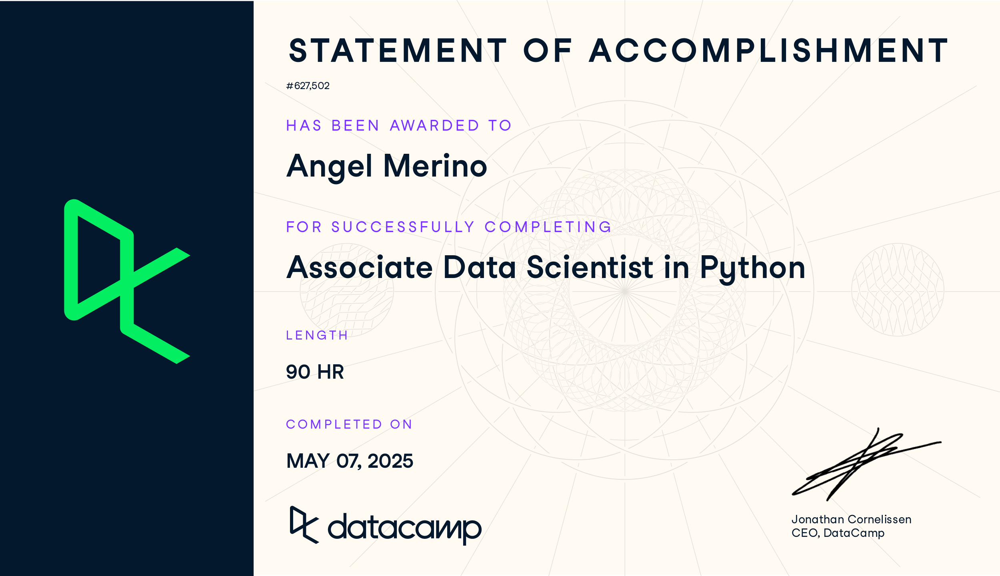
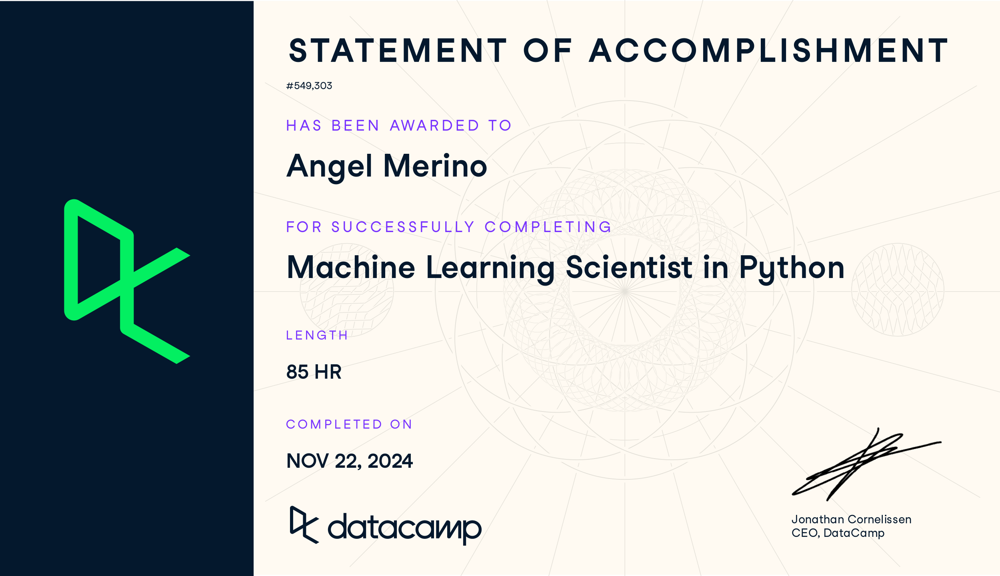
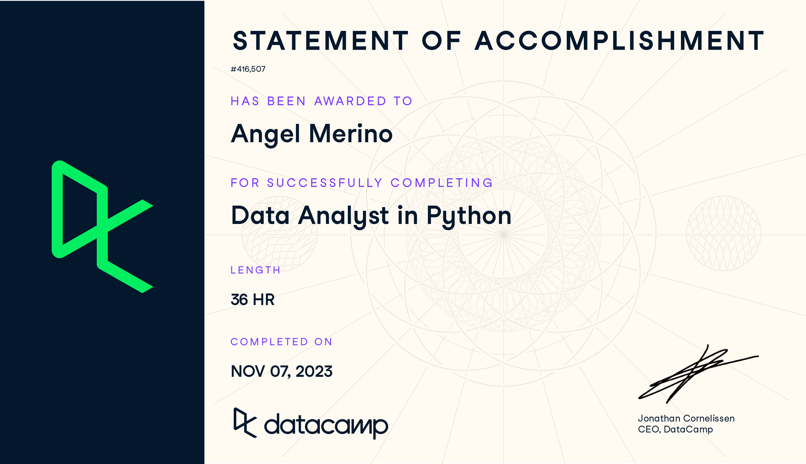
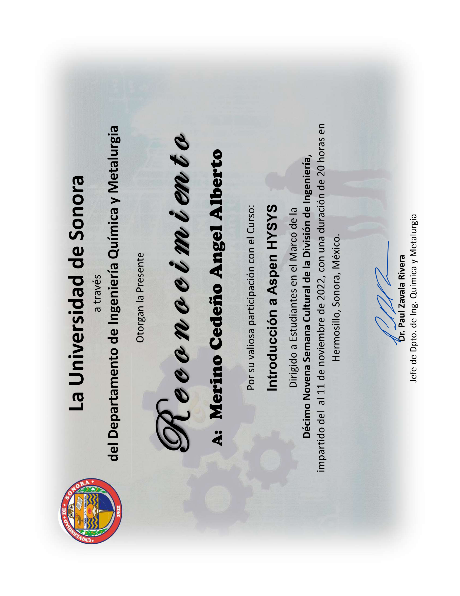

A continuación presento los certificados más relevantes en mi desarrollo profesional.

## Ciencia de Datos & Machine Learning

::: {.grid}

::: {.g-col-12 .g-col-md-6}
::: {.card .h-100}
::: {.card-body}
### Associate Data Scientist in Python
**DataCamp** · 90 horas · Mayo 2025

{.img-fluid .rounded}

**Temas:**

* Python para ciencia de datos
* Análisis exploratorio y estadístico
* Machine Learning supervisado

::: {.card-footer .bg-transparent .border-0}
Data Science
Python
DataCamp
  
[📄 Ver certificado (PDF)](certificados/Associate%20data%20scientist%20in%20python.pdf){.btn .btn-outline-primary .btn-sm target="_blank"}
:::
:::
:::
:::

::: {.g-col-12 .g-col-md-6}
::: {.card .h-100}
::: {.card-body}
### Machine Learning Scientist in Python
**DataCamp** · 85 horas · Noviembre 2024

{.img-fluid .rounded}

**Temas:**

* Modelos supervisados y no supervisados
* Deep Learning fundamentals
* Feature engineering

::: {.card-footer .bg-transparent .border-0}
Machine Learning
Python
DataCamp
  
[📄 Ver certificado (PDF)](certificados/Machine%20learning%20scientist%20in%20python.pdf){.btn .btn-outline-primary .btn-sm target="_blank"}
:::
:::
:::
:::

:::

---

## Análisis de Datos

::: {.grid}

::: {.g-col-12 .g-col-md-6}
::: {.card .h-100}
::: {.card-body}
### Data Analyst in Python
**DataCamp** · 36 horas · Noviembre 2023

{.img-fluid .rounded}

**Temas:**

* Manipulación de datos con Pandas
* Visualización de datos
* Análisis estadístico

::: {.card-footer .bg-transparent .border-0}
Data Analysis
Python
DataCamp
  
[📄 Ver certificado (PDF)](certificados/Data%20analyst%20in%20python.pdf){.btn .btn-outline-primary .btn-sm target="_blank"}
:::
:::
:::
:::

:::

---

## Ingeniería & Simulación

::: {.grid}

::: {.g-col-12 .g-col-md-6}
::: {.card .h-100}
::: {.card-body}
### Introducción a Aspen HYSYS
**Universidad de Sonora** · 20 horas · Noviembre 2022

{.img-fluid .rounded}

**Temas:**

* Simulación de procesos químicos
* Ingeniería Química y Metalurgia
* Herramientas de diseño industrial

::: {.card-footer .bg-transparent .border-0}
Ingeniería
Simulación
UNISON
  
[📄 Ver certificado (PDF)](certificados/ASPEN_HYSYS.pdf){.btn .btn-outline-primary .btn-sm target="_blank"}
:::
:::
:::
:::

:::