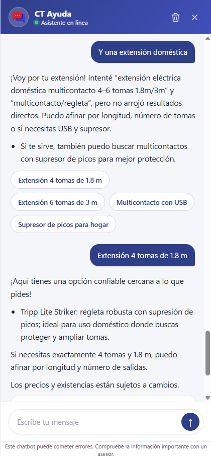

::: {style="text-align: justify"}
## 1. Modelado

El objetivo de esta fase es desarrollar la arquitectura del sistema de recuperación aumentada con generación (RAG) y las herramientas que utilizará el chatbot para la información dinámica. Para ello, se utiliza como fuente de conocimiento la base de datos vectorizada construida en la etapa anterior.

### 1.1. Modelos

El proyecto se apoya principalmente en modelos de OpenAI, y la selección se actualiza conforme salen modelos más rápidos y capaces. Actualmente se usan dos modelos con roles distintos:

- **GPT-5 (agente principal):**
  Orquesta el razonamiento, la invocación de herramientas y la generación de la respuesta final. Se ejecuta con `reasoning_effort="low"` para priorizar la velocidad (el caso de uso requiere respuestas rápidas con poco razonamiento) y con `stream_usage=True` para registrar el consumo de tokens al transmitir en _streaming_.

- **GPT-4.1-mini (moderador):**
  Modelo pequeño y rápido **dedicado exclusivamente a clasificar** cada consulta (`relevante` / `irrelevante` / `inapropiado`). Como es una tarea de una sola etiqueta, usar un modelo ligero reduce la latencia previa a la respuesta y el costo, en lugar de gastar el modelo principal en moderar.

- **Modelos open-source vía Ollama (opcional):**
  El sistema mantiene compatibilidad con modelos locales (LLaMA, Mistral, Gemma, etc.) mediante `ChatOllama`, como alternativa de código abierto; no es el camino por defecto en producción.

El modelo es configurable y los precios por modelo se mantienen sincronizados en `settings/tokens.py`.

### 1.2. Arquitectura del sistema 

La implementación del sistema se basa en una estructura modular orientada a clases. Esto permite una mayor reutilización de código, facilita su mantenimiento y mejora la legibilidad, aspectos clave para futuras modificaciones o revisiones.

Además, esta estructura permite importar únicamente la clase necesaria para ejecutar todo el sistema, lo cual es ideal para su integración a través de una API. De esta forma, se evita depender de notebooks o archivos extensos y poco escalables.

El sistema se construyó utilizando principalmente la librería **LangChain**, la cual ofrece una base robusta para conectar modelos de lenguaje con herramientas externas y flujos personalizados.

#### 1.2.1. Información estática

A partir de los datos mencionados en el apartado anterior, procederemos a crear la base de datos vectorial con esta información. Tomamos los datos limpios y transformados directamente de las funciones de limpieza (`clean_products` y `clean_sales` en `ct/ETL/transform.py`) y los convertimos en un tipo `Document` para poder insertar la información a FAISS (base vectorial) junto con los `embeddings` y guardarlo de forma local.

```python
campos = [
        "nombre",
        "producto",
        "categoria",
        "marca",
        "tipo",
        "modelo",
        "detalles",
        "fichaTecnica",
        "resumen"
        ]

docs = [
    Document(
        page_content=construir_contenido(producto, campos), # recibe la información de cada producto y las columnas 
        metadata={"collection": 'promociones'} # o 'productos' dependiendo el caso
    )
    for producto in productos
]

# Usar embeddings de OpenAI 
embeddings = OpenAIEmbeddings(api_key=api_key)

# Crear base de datos FAISS con los documentos
vectorstore = FAISS.from_documents(docs, embeddings)

# Guardar la base de datos para futuras consultas
vectorstore.save_local()
```

#### 1.2.2. Información dinámica

Además de la información estática precargada en la base vectorial, el sistema cuenta con herramientas dinámicas que consultan datos actualizados en tiempo real (existencias, precios, promociones, estatus de pedidos, etc.). Las herramientas se registran con el decorador `@tool` de LangChain y se conectan al agente mediante `create_agent` (LangGraph), que decide cuándo invocarlas.

Las herramientas activas del agente son:

* `algolia_search_tool`: buscador de productos (Algolia). Devuelve, por cada producto, su **clave CT**, marca, modelo, precio según lista, existencias en la sucursal del usuario y en otras sucursales, si está en promoción, la URL y la **URL de imagen** del producto (esta última la usa la interfaz para armar las tarjetas).
* `sales_rules_tool`: reglas de promoción. **Acepta varias claves en una sola llamada** y reutiliza una única conexión, devolviendo el precio/condición de promoción de cada una.
* `dolar_convertion_tool`: convierte precios de USD a MXN para cálculos de presupuesto.
* `status_tool`: consulta el estatus de un pedido a partir de su factura (MongoDB).
* `get_support_info`: políticas, garantías, devoluciones, términos y condiciones, PartnerCT, directorio de PMs, etc.
* `who_are_we`: información institucional de CT.
* `get_sucursales_info`: ubicación, horarios, teléfonos y directorios de sucursales.

```python
self.tools = [
    algolia_search_tool,
    sales_rules_tool,
    dolar_convertion_tool,
    status_tool,
    get_support_info,
    who_are_we,
    get_sucursales_info,
]

self.graph = create_agent(
    model=self.llm,
    tools=self.tools,
    system_prompt=encode(prompt_dict),
    context_schema=UserContext,
    cache=InMemoryCache(),
)
```

Estas herramientas son invocadas automáticamente por el agente cuando la consulta requiere información que no está en el contexto estático, lo que permite respuestas alineadas con la situación real del negocio (existencias, promociones activas, etc.). Las consultas a MySQL (existencias y promociones) usan un **pool de conexiones reutilizable** (`get_mysql_connection` en `settings/clients.py`) para evitar el costo de abrir una conexión nueva en cada llamada.

#### 1.2.3. Flujo de datos para el sistema RAG

El sistema se alimenta con información a través de un proceso ETL (Extracción, Transformación y Carga) que asegura que los datos estén limpios, estructurados y listos para ser utilizados por el modelo y las herramientas.

**Para una descripción detallada de cada etapa del proceso ETL, incluyendo la extracción de datos, la transformación (y el almacenamiento de fichas técnicas en MongoDB), y la carga directa a la base de datos vectorial, por favor, consultar el documento "Preparación de los datos".**

En resumen, este proceso garantiza que el modelo tenga acceso a una base de datos de conocimiento robusta y actualizada, tanto estática (productos y promociones embedidas) como dinámica (a través de las herramientas que consultan datos en tiempo real).

#### 1.2.4. Entrega de la respuesta: streaming y bloques estructurados

La respuesta se transmite al cliente en **streaming token a token**. El agente usa `graph.astream(..., stream_mode=["messages", "values"])`: el modo `messages` emite los tokens conforme el LLM los genera (efecto "escribiendo"), mientras que el último estado de `values` conserva la metadata final (uso de tokens, costo y _verbose log_) para registrarla en MongoDB sin romper el guardado. Anteriormente la respuesta se calculaba completa con `ainvoke` y se entregaba de golpe; el cambio a `astream` permite mostrarla progresivamente.

Para enriquecer la interfaz sin abandonar el transporte de texto, el modelo emite —dentro del mismo flujo— **bloques estructurados in-band** delimitados con vallas de código:

* ` ```ct-products `: arreglo JSON con los productos a mostrar (clave, marca, modelo, imagen, precio, existencias por sucursal y promoción). La interfaz lo convierte en **tarjetas con imagen**.
* ` ```ct-suggestions `: arreglo JSON de sugerencias accionables que el usuario puede pulsar para continuar la conversación.

El frontend extrae estos bloques de forma **incremental** (renderiza cada tarjeta/sugerencia en cuanto queda completa, sin esperar a que cierre el bloque) y nunca muestra el JSON crudo.

### 1.3. Atributos del modelo y contexto de ejecución

Durante la ejecución del sistema, los modelos de lenguaje no operan en aislamiento. Se alimentan con diversos atributos y herramientas que enriquecen la interacción y permiten generar respuestas precisas y contextualizadas. A continuación, se describen los principales elementos que intervienen en este proceso y cómo la información preparada se integra en el modelo:

**Atributos del modelo en tiempo de ejecución**

* `query`: Pregunta o instrucción directa del usuario. Es el punto de entrada para iniciar el procesamiento.
* `session_id`: Identificador de sesión que permite obtener el contexto del usuario (incluye la sucursal asociada para aplicar reglas de negocio como promociones).
* `listaPrecio`: Parámetro numérico que indica la lista de precios correspondiente al usuario la cual ajusta el precio de productos y promociones.

Estos atributos permiten personalizar las respuestas con base en el usuario que consulta, su sucursal, y las reglas comerciales que le aplican.

**Alimentación del modelo con información adicional**

El LLM se alimenta con información contextualizada de dos maneras principales, ambas derivadas de los datos procesados en la fase de Preparación de los Datos:

* **Información estática (a través del RAG)**:
  * Proviene de la base de datos vectorial (FAISS) construida con la información previamente incrustrada mediante `OpenAIEmbeddings`.
  * Cuando el usuario realiza una `query` relevante, el sistema RAG busca los documentos más similares en el vector store. Estos documentos (`page_content` y `metadata`) se inyectan en el _context window_ del LLM como información de referencia.
  * Esto se activa principalmente para consultas generales de productos, descripciones, características, comparativas, etc., permitiendo al LLM generar respuestas basadas en un conocimiento específico y actualizado de tu catálogo.

* **Información dinámica (a través de herramientas LangChain)**:

  * Se accede a datos en tiempo real mediante herramientas personalizadas integradas con LangChain, como `algolia_search_tool` y `sales_rules_tool`.
  * El LLM, basado en la `query` del usuario y su propio razonamiento, decide cuándo invocar estas herramientas. Por ejemplo, si el usuario busca un producto, el LLM activará `algolia_search_tool`, y si hay productos en promoción consultará `sales_rules_tool` (con las claves correspondientes en una sola llamada).
  * El resultado de la ejecución de estas herramientas (e.g., el precio actual, las existencias, el precio final con promoción) se devuelve al LLM y se inyecta también en su _context window_.
  * Esto permite al LLM generar respuestas con datos actualizados y específicos, como la disponibilidad de un producto o el precio final con promociones activas para una `listaPrecio` y `session_id` dados.

**Moderación y clasificación de la consulta**

Antes de ejecutar cualquier acción, la consulta pasa por una etapa de moderación:

* Se valida si el usuario está baneado (sistema de _ban_ progresivo por comportamiento inapropiado reincidente).
* Se clasifica la consulta como `relevante`, `irrelevante` o `inapropiado` usando un **modelo dedicado y ligero (GPT-4.1-mini)**, invocado de forma **asíncrona** (`ainvoke`) para no bloquear el _event loop_ del servidor.
* Dependiendo de esta clasificación, se permite el paso al agente principal y sus herramientas, o se responde con un mensaje predefinido (sin gastar el modelo principal).

Este flujo asegura robustez, control y trazabilidad, y al separar la moderación en un modelo rápido reduce la latencia previa a la respuesta.


### 1.4. Métricas de evaluación

A diferencia de los modelos clásicos de *machine learning* (ML), la evaluación de sistemas basados en modelos de lenguaje grande (LLMs) requiere enfoques distintos, centrados en la calidad de las respuestas generadas.

En este proyecto, la evaluación se realiza mediante un análisis cualitativo de las respuestas del chatbot, tomando en cuenta los siguientes criterios:

- La información sobre productos, descripciones y características debe estar alineada con los datos disponibles en la base vectorial.
- Las respuestas deben ser claras, concisas y coherentes, evitando alucinaciones o información incorrecta.
- Los precios deben coincidir con los establecidos en la base de datos, y en el caso de promociones, estas deben estar correctamente aplicadas, evitando errores que impliquen pérdidas económicas.

Estos criterios serán evaluados por los expertos y personas con conocimiento en la empresa.
:::

::: {style="text-align: justify"}
## 2. Evaluación

Con base en las respuestas generadas durante la etapa de modelado, se llevó a cabo una evaluación cualitativa para analizar la coherencia, relevancia y precisión de las recomendaciones de cada modelo. Este análisis nos permitió identificar oportunidades de mejora en el sistema, así como validar si el comportamiento del modelo es adecuado para continuar con su implementación o si requiere ajustes adicionales.

A continuación, se presentan las respuestas generadas por el sistema para una serie de consultas simuladas por un usuario. Estas imágenes muestran el resultado del modelo seleccionado en aquel momento de la evaluación (GPT-4o); la selección de modelos se ha actualizado desde entonces y actualmente el agente principal es **GPT-5** (con GPT-4.1-mini para la moderación):

1. **Consulta:** _"¡Hola! Me interesan computadoras de oficina"_  
   {width=40%}

2. **Consulta:** _"También me gustaría ver monitores de 27 pulgadas arriba de 75Hz"_  
   {width=40%}

3. **Consulta:** _"Y un no break gamer"_  
   {width=40%}

4. **Consulta:** _"Y una extensión doméstica"_  
   {width=40%}

Los resultados obtenidos reflejan un desempeño sólido y estable por parte del sistema. En todos los casos evaluados, las respuestas del chatbot fueron coherentes, alineadas con la base de datos y cumplieron con los criterios definidos:

- Las ofertas y promociones fueron correctamente identificadas y presentadas.
- Los precios y descripciones de los productos coincidieron con los datos reales.
- No se observaron errores de alucinación ni pérdidas de coherencia en la conversación.

Esto sugiere que el modelo es capaz de generar respuestas confiables y útiles para los usuarios, por lo que se considera viable continuar con las siguientes etapas del proyecto o bien escalar el sistema hacia una versión de prueba.
:::