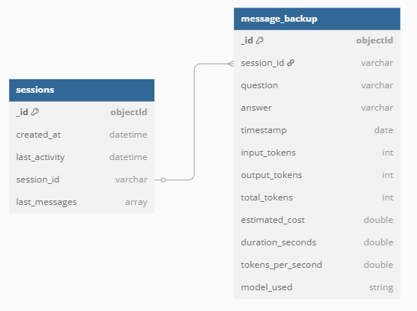
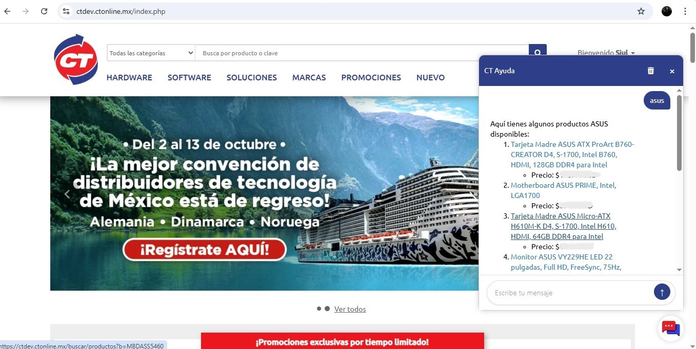
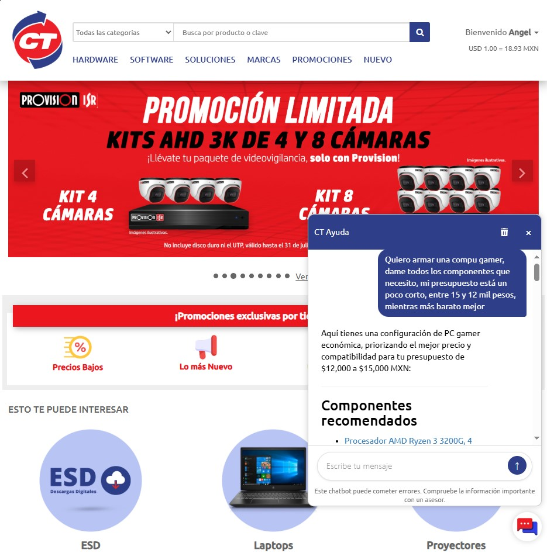

::: {style="text-align: justify"}
## 1. Revisión del proceso

El desarrollo del proyecto de Chatbot siguió un enfoque iterativo, basado en los principios del ciclo CRISP-DM. Esta metodología estructurada permitió abordar las distintas fases del proyecto de manera organizada, con un énfasis continuo en la mejora del diseño, la calidad del código y, fundamentalmente, el rendimiento del sistema en sus componentes clave.

Los principales retos se concentraron en la fase de extracción, manipulación y estructuración de los datos, con el objetivo de mantenerlos lo más *tidy* posible y así garantizar una mayor precisión y coherencia en las respuestas generadas por el sistema. Además de las condiciones bajo las promociones y el dinamismo de los precios tanto para productos normales como ofertas.

A lo largo de los ciclos de desarrollo, se han cumplido los hitos establecidos, manteniendo un ritmo de trabajo adecuado; aunque hubieron varios cambios, o ajustes, con respecto a la propuesta inicial mencionada en la comprensión del negocio, el objetivo sigue siendo el mismo: 

  _Optimizar el proceso de recomendación de productos y acceso de la información técnica-pública dentro de la empresa mediante el uso de inteligencia artificial, mejorando la precisión y eficiencia en la búsqueda de opciones alineadas con las necesidades de los clientes._

La fase de evaluación, aunque continua, ha mostrado resultados prometedores que sugieren que el sistema, en su estado actual, posee la robustez necesaria para avanzar a una etapa de prueba en un entorno controlado y, posteriormente, al entorno de producción.

### 1.1. Determinar próximos pasos

Considerando los avances y los aprendizajes obtenidos, se evaluaron dos opciones principales para la continuación del proyecto:

* **Continuar en fases de desarrollo/modelado:** Dedicar más tiempo a la refinación interna de los datos, explorar técnicas avanzadas de preprocesamiento, o actualizar versiones de modelos y librerías principales.
* **Pasar a la fase de implementación en un entorno de prueba:** Desplegar el sistema en un entorno controlado que simule las condiciones de uso real, permitiendo obtener *feedback* directo y validar el comportamiento del chatbot en interacción con usuarios y la infraestructura existente.


### 1.2. Decisión

Se ha decidido priorizar la **implementación en la página de pruebas** de la empresa. Esta decisión se fundamenta en la necesidad de validar el sistema en un entorno lo más cercano posible a producción, identificar rápidamente fallos en la integración, la experiencia del usuario, y orientar los ciclos de mejora futuros con base en datos de uso real. La implementación en pruebas servirá como una plataforma funcional sobre la cual se podrá continuar iterando y perfeccionando la solución de manera incremental, hasta llevarlo a una etapa de producción por etapas; siendo usuarios de la empresa los primeros en probarlo, hasta los usuarios finales (externos).
:::

::: {style="text-align: justify"}
## 2. Plan de implementación

La fase de implementación implica el despliegue de los componentes desarrollados y su integración en el entorno web de pruebas de CT Online. El objetivo es habilitar el widget de chatbot para un grupo controlado de usuarios.

### 2.1. Arquitectura de despliegue y conexión

La fase de implementación requiere el despliegue de la API del chatbot (Python + FastAPI) y la integración del widget (JavaScript, HTML y CSS) en la página web de CT Online.

**Enfoque anterior (proxy PHP).** Inicialmente no se contaba con un certificado SSL válido para la API (solo autofirmado, que los navegadores modernos no reconocen como confiable). Como la página se sirve por **HTTPS**, llamar directamente a una API en HTTP provocaba errores de **"contenido mixto" (mixed content)**, que el navegador bloquea. La solución fue usar el **backend PHP** del sitio como _proxy_: el widget llamaba a un endpoint del PHP (mismo origen, HTTPS), y el PHP reenviaba la petición a la API y devolvía la respuesta. Esto resolvía el contenido mixto encapsulando el tramo inseguro en la comunicación servidor-a-servidor, pero tenía un costo importante: el PHP **bufferizaba** la respuesta y la re-serializaba a JSON, lo que **impedía el _streaming_ real** (la respuesta llegaba "de golpe").

**Enfoque actual (dominio certificado + llamadas directas).** Al disponer de un **certificado válido y un dominio gestionado con Cloudflare**, se elimina el salto intermedio: el frontend de la página llama **directamente** a la API por HTTPS. Además de simplificar la arquitectura, esto **habilita el _streaming_ token a token** (ya no hay un proxy que acumule la respuesta). En concreto:

* El **SDK del widget se sirve desde el propio servidor FastAPI**, montado en la ruta `/sdk` con `StaticFiles`. El equipo de la página solo incrusta un `<script>` que apunta al dominio del chatbot; el `sdk.js` deriva por sí mismo la URL base de la API a partir del origen de su propio script.
* Las peticiones del widget (`/chat`, `/history/{id}`) viajan **directo** al servidor certificado.
* Cloudflare termina TLS en el borde y reenvía al origen. Se recomienda el modo **"Full (strict)"** con un _Origin Certificate_ de Cloudflare instalado en el servidor, reemplazando el autofirmado.

> El corte al dominio certificado se realiza al aprovisionar el dominio/Cloudflare. El resto de los cambios que lo acompañan (SDK servido desde el servidor, _streaming_, y el endurecimiento de seguridad descrito más adelante) ya están integrados y listos para ese corte.

### 2.2. Gestión de persistencia de datos con MongoDB

Una mejora significativa en la arquitectura del chatbot ha sido la migración de la gestión del historial de conversaciones desde archivos JSON locales a una base de datos NoSQL, específicamente MongoDB. Esta decisión se tomó para optimizar el almacenamiento, mejorar el rendimiento y facilitar el análisis de datos, especialmente considerando el volumen y la frecuencia de las interacciones de los usuarios.

La implementación en MongoDB se estructura en dos colecciones principales:

* **`sessions`:** Esta colección está diseñada para mantener los últimos `n` mensajes de cada sesión de usuario. Su objetivo es asegurar una recuperación de mensajes mínima y rápida, optimizando la experiencia del usuario final al evitar la carga de historiales extensos en cada interacción. Cada vez que se añade un nuevo mensaje, el más antiguo se desplaza si se supera el límite de mensajes configurado, manteniendo la colección ligera y eficiente para las operaciones del chatbot.

* **`message_backup`:** A diferencia de `sessions`, esta colección actúa como un histórico completo de todos los mensajes generados. Su propósito principal es el análisis de datos y la alimentación de sistemas de reportes automatizados. El esquema de esta colección está pensado para simular una tabla SQL, lo que facilita la búsqueda y recuperación de información para análisis posteriores. Cada documento en esta colección incluye tanto la consulta del usuario como la respuesta del chatbot, junto con metadatos relevantes como *timestamps* y detalles de tokens utilizados.

Esta estrategia de persistencia de datos en MongoDB ha permitido superar las limitaciones de los archivos JSON, que no eran escalables para una gran cantidad de usuarios, ofreciendo un camino más robusto y óptimo para almacenar la información de las conversaciones.

{width=90%}

### 2.3. Desarrollo del widget frontend

Se desarrolló un widget de chat personalizado e integrable mediante un solo script (`sdk.js`). El widget inyecta la interfaz de usuario y carga dinámicamente la lógica (`app.js`) y los estilos (`styles.css`); todos estos recursos se sirven desde el propio servidor (`/sdk`), por lo que la integración en la página se reduce a un único `<script>`.

Características principales de la interfaz actual:

* **Panel lateral (sidebar):** el chat se abre como una barra lateral fija y amplia (en lugar de una burbuja pequeña), con animación de entrada y diseño responsivo (pantalla completa en móvil).
* **Respuesta en _streaming_:** el texto se renderiza token a token (efecto "escribiendo"), con _throttling_ del parseo de Markdown para evitar parpadeos.
* **Tarjetas de producto:** a partir del bloque `ct-products`, cada producto se muestra como una tarjeta con imagen, **clave CT** como título, marca/modelo, precio, _badge_ de promoción y existencias ("N en tu sucursal / N en otras sucursales"). Las tarjetas aparecen **de forma incremental** (una a una conforme se completan).
* **Sugerencias accionables:** a partir del bloque `ct-suggestions`, se muestran _chips_ que el usuario puede pulsar para continuar; al abrir el chat sin historial se ofrecen sugerencias iniciales basadas en las capacidades del bot.
* **Botón de detener:** mientras el bot responde, el botón de enviar cambia a "detener", permitiendo abortar la respuesta en curso (`AbortController`) conservando lo ya recibido.
* **Seguridad de render:** los datos de las tarjetas se escapan y las URLs (imagen/enlace) se validan como `http(s)` para evitar inyección.

### 2.4. Plan de monitoreo

Durante la fase de pruebas, se implementará un plan de monitoreo para evaluar el rendimiento y comportamiento del sistema. Las métricas clave a seguir incluirán:

* **Tiempo de respuesta de la API:** Latencia entre el envío de una consulta y la recepción de la primera parte o la respuesta completa.
* **Tasa de éxito/Error de las peticiones a la API:** Proporción de peticiones que resultan en códigos de estado.
* **Calidad de las respuestas:** Evaluación manual o semi-automatizada de la coherencia, relevancia y precisión de las respuestas del chatbot, especialmente en casos donde no se encuentran recomendaciones.
* **Frecuencia de uso del widget:** Número de aperturas del chat y cantidad de interacciones por usuario.
* **Errores en la consola del navegador:** Monitoreo de errores de JavaScript o CSS reportados por los usuarios durante el uso del widget.

### 2.5. Plan de mantenimiento

Se establecerá un plan de mantenimiento periódico para asegurar la estabilidad y el buen funcionamiento del sistema desplegado:

* **Actualización de dependencias:** Programar revisiones y actualizaciones de las librerías y paquetes utilizados en la API (Python, Langchain, FastAPI, etc.) y potencialmente en el frontend si se usan librerías externas.
* **Revisión de logs:** Monitorear activamente los logs del servidor donde corre la API y de los servicios web para identificar y solucionar errores.
* **Auditoría de calidad de datos y respuestas:** Realizar evaluaciones regulares de la calidad de los datos de origen y verificar la calidad de las respuestas generadas por el modelo con el tiempo.
* **Refactorización y optimización:** A medida que se identifiquen áreas de mejora o cambien los requisitos, planificar tareas de refactorización de código para mejorar la modularidad, el rendimiento o la mantenibilidad.

### 2.6. Experiencia de desarrollo

El proyecto ha permitido consolidar la experiencia en el ciclo completo de desarrollo de una aplicación basada en modelos de lenguaje, desde la comprensión y preparación de datos complejos, pasando por el prototipado con herramientas como Langchain, hasta el desarrollo de una API robusta con FastAPI y la implementación de una interfaz de usuario dinámica y reusable (widget frontend desarrollado en `JS`, `HTML` y `CSS`). La resolución de desafíos específicos como el manejo de diferentes estructuras de datos para las vector stores y la integración segura de una API a un entorno web real (HTTPS/contenido mixto, CORS, permisos de red) han sido aprendizajes clave con complicaciones y problemas que se pudieron corregir y solucionar. Se han seguido buenas prácticas de desarrollo, enfocándose en la modularidad para facilitar futuras expansiones (ej: integración de LangGraph) y el mantenimiento del código.

### 2.7. Despliegue del chatbot en el sistema de desarrollo

El chatbot fue desplegado exitosamente en el entorno de pruebas de CT Online, habilitado específicamente para fines de desarrollo e integración continua. Este entorno permite validar en condiciones casi reales el comportamiento tanto del frontend (widget) como de la API conversacional.

El proceso de despliegue consistió en los siguientes pasos:

* **Montaje del entorno de la API:** La API desarrollada con FastAPI se desplegó en un servidor, o ambiente virtual de linux, utilizando Gunicorn como servidor de aplicaciones y conectándose al backend de la página de CT Online.
* **Integración del widget en la página de pruebas:** Se inyectó el script del widget directamente en la página, asegurando que se pudieran cargar dinámicamente los recursos necesarios (`JS`, `HTML` y `CSS`) desde un servidor de archivos estáticos. La integración se validó en distintos navegadores modernos para asegurar la compatibilidad y el correcto funcionamiento.
* **Gestión de versiones y control de cambios:** Se utilizó Git para gestionar versiones del código tanto del sistema del Chatbot, la API y del widget. Esto permitió llevar un registro detallado de los cambios realizados y facilitó el proceso de despliegue incremental, en caso de futuras modificaciones o ajustes.
* **Verificación funcional:** Tras el despliegue inicial, se realizaron pruebas manuales y automatizadas para verificar el correcto funcionamiento del flujo de conversación, el tiempo de respuesta de la API y el comportamiento del widget en diferentes escenarios (errores, entradas no reconocidas, ausencia de resultados, etc.).
* **Consideraciones de seguridad:** Al pasar a llamadas directas, el servidor queda expuesto públicamente, por lo que se añadió un endurecimiento ligero y configurable por entorno (módulo `settings/security.py`): **allowlist de orígenes CORS** (variable `CHATBOT_ALLOWED_ORIGINS`, resolviendo el conflicto previo de `allow_origins=["*"]` con credenciales), **validación de Origin/Referer** en el endpoint `/chat`, y **rate limiting** por IP + `user_id` (ventana deslizante en memoria). Estas protecciones son _opt-in_: si no se define la allowlist se mantiene el comportamiento abierto (desarrollo), y se activan al fijar el dominio en el corte a producción.

La imagen a continuación muestra el chatbot funcionando en su entorno de desarrollo, con el widget incrustado en la página de pruebas de CT Online:

{width=90%}

Este hito marca un avance significativo hacia la validación en entorno real del sistema conversacional, permitiendo recopilar feedback de usuarios internos antes de considerar un despliegue completo en producción.

### 2.8. Despliegue del chatbot en el sistema de producción

A partir del despliegue en el ambiente de pruebas, donde recopilamos retroalimentación e hicimos iteraciones sobre el modelo, finalmente pudimos desplegarlo al ambiente de producción. Este despliegue es escalonado, empezando por la sucursal de Hermosillo y con los vendedores de la empresa, recopilando nuevamente retroalimentación pero más pegada a casos de estudio concretos y reales.

{width=90%}
:::

::: {style="text-align: justify"}
## 3. Integración y Despliegue Continuo (CI/CD)

Para cerrar el ciclo de entrega, el proyecto cuenta con un flujo de **integración continua (CI)**
y **despliegue continuo (CD)** complementarios.

### 3.1. Integración Continua (CI)

El *pipeline* de CI vive en `.github/workflows/ci.yml` y se dispara en cada `push` y
`pull_request` contra `main`. Consta de dos *jobs* encadenados:

1. **`test`**: instala dependencias con `uv` y ejecuta la suite de `pytest` con reporte de
   cobertura.
2. **`build-podman`**: solo corre si las pruebas pasan; construye la imagen del contenedor con
   Buildah a partir del `Dockerfile`.

### 3.2. Servicio de producción (systemd)

La API se ejecuta como un servicio de **systemd** (`chatbot-api`), no con `nohup`. Esto permite
que arranque automáticamente al iniciar el servidor y que se reinicie sola ante caídas, gracias a
`Restart=always`:

```ini
# /etc/systemd/system/chatbot-api.service (resumen)
[Service]
User=angel.merino
WorkingDirectory=/home/angel.merino/proyectoCT
ExecStart=/home/angel.merino/proyectoCT/.venv/bin/python -m gunicorn ct.main:app \
  --workers 4 --bind 0.0.0.0:8000 \
  --certfile=static/ssl/cert.pem --keyfile=static/ssl/key.pem \
  -k uvicorn.workers.UvicornWorker --timeout 120 \
  --access-logfile - --error-logfile -
Restart=always
```

### 3.3. Despliegue Continuo (CD) por modelo *pull*

El despliegue sigue un esquema **pull (GitOps)**: el propio servidor sondea el repositorio y se
actualiza solo, evitando exponer accesos SSH o credenciales de un registro hacia GitHub. Lo maneja
el script `deploy.sh`, ejecutado por `cron` cada 5 minutos:

```bash
*/5 * * * * /bin/bash $HOME/proyectoCT/deploy.sh >> $HOME/proyectoCT/logs/deploy.cron.log 2>&1
```

En cada corrida el script:

1. Hace `git fetch` y compara `HEAD` con `origin/main`; si no hay cambios, termina en silencio.
2. **Valida el CI** del commit remoto: solo continúa si todos los *check-runs* de GitHub Actions
   quedaron en `success` (consulta vía `gh api`, usando un `GH_TOKEN` guardado en `.env`). Si el
   CI sigue en curso o falló, pospone el despliegue.
3. Aplica los cambios con `git merge --ff-only` y decide la acción según **qué archivos
   cambiaron**:
   - `pyproject.toml` / `uv.lock` → `uv sync --frozen` + reinicio completo
     (`sudo systemctl restart chatbot-api`).
   - Archivos en `src/` → recarga *graceful* de los workers (`pkill -HUP -f gunicorn`).
   - Solo documentación, Quarto, UI o tests → aplica el `pull` **sin reiniciar** el servicio.

Dado que `datos/vectorstores/`, `static/ssl/` y `.env` están en `.gitignore`, el `git pull` nunca
sobrescribe los índices FAISS, los certificados ni los secretos. Si `uv sync` falla, el script
**no** reinicia el servicio, evitando dejar producción en un estado roto. Los registros del
despliegue quedan en `logs/deploy.log`.
:::