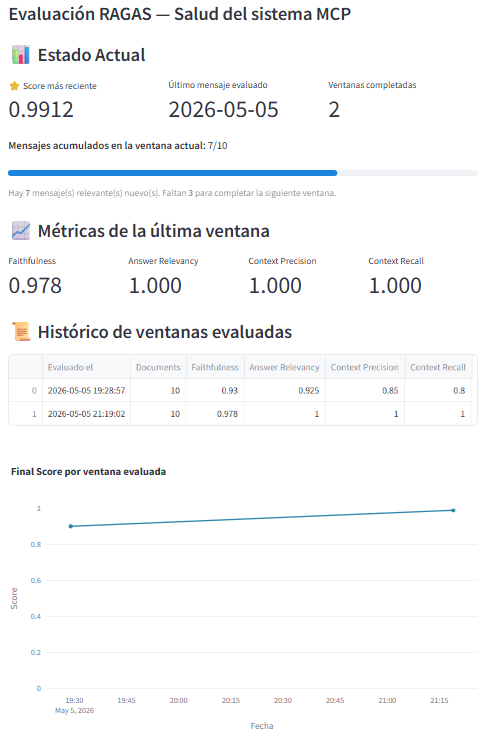
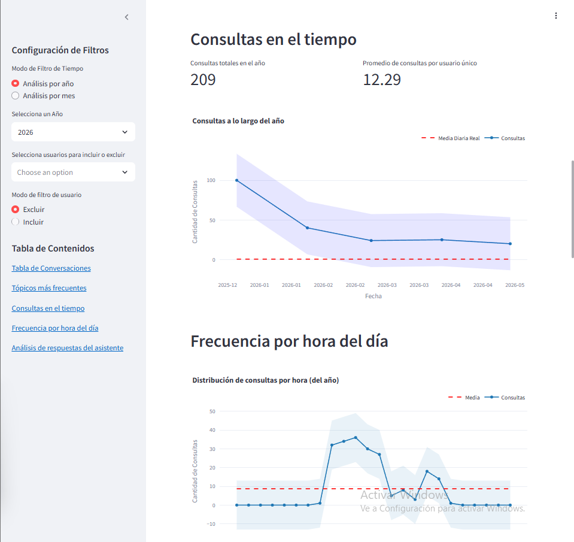

::: {style="text-align: justify"}
## 1. Manual de instalación y despliegue.

### 1.1. Configuraciones importantes

* El proyecto está diseñado para ser desplegado en entornos **Linux o Windows** con **Python 3.13.1** (versión fijada en `.python-version`; `pyproject.toml` admite `>=3.11`). Usa modelos de **OpenAI** por defecto (GPT-5 como agente principal y GPT-4.1-mini para la moderación), por lo que requiere una `OPENAI_API_KEY` válida; **opcionalmente** puede usar modelos *open-source* vía **Ollama** (p. ej. `gemma3:12b`). Requiere además conectividad a una instancia de **MongoDB** y a las bases de datos **MySQL**.
* La aplicación *backend* se expone a través de **FastAPI** en el puerto `8000`. Es crucial asegurar que este puerto esté abierto y accesible en el entorno de despliegue.
* Archivo `.env` con variables cargadas.
* Todas las credenciales y configuraciones sensibles se gestionan mediante un archivo de variables de entorno (`.env`), garantizando la seguridad y facilidad de configuración.

### 1.2. Requisitos del sistema

* **Python**: Versión 3.13.1.
* **Pip**: Última versión.
* **UV**: Última versión (gestor de paquetes y entornos).
* **Ollama** (opcional): Instalado y en ejecución solo si se desean usar modelos *open-source* locales; no es necesario con la configuración por defecto (OpenAI).
* **MySQL**: Acceso remoto configurado para la extracción de datos de productos y precios. 
* **Podman**: Gestión y ejecución de los contenedores de los cuales depende la aplicación (MongoDB y Redis).
* **MongoDB**: Acceso remoto configurado para las colecciones de historial, productos, ofertas y fichas técnicas.
* **Redis**: Acceso a través de Podman para cachear preguntas y respuestas.
* **Permisos `sudo`**: El usuario que ejecuta el servicio (`angel.merino`) requiere `sudo` **sin password** para operar los servicios systemd (`systemctl restart chatbot-api`, etc.) desde un cron no-interactivo. Esto se configura una sola vez con el archivo versionado [`deploy/chatbot-api.sudoers`](https://github.com/anmerino-pnd/proyectoCT/blob/main/deploy/chatbot-api.sudoers), que se instala en `/etc/sudoers.d/chatbot-api` y delimita el permiso únicamente a los comandos necesarios (ver sección 6.7 para los detalles). Sin este permiso, el flujo de despliegue continuo (CD) automatizado no puede reiniciar la API cuando cambian dependencias.

### 1.3. Dependencias principales del sistema

* `langchain`: Framework principal para la construcción de cadenas RAG y la orquestación del flujo del chatbot.
* `OpenAI`: API de OpenAI con créditos para poder utilizar los modelos de LLM y Embeddings.
* `tiktoken`: Utilizado para el conteo preciso de tokens en las consultas y respuestas, fundamental para la estimación de costos.
* `ollama`: Herramienta para servir modelos de lenguaje *open-source* localmente, como `gemma3:12b`, permitiendo flexibilidad en la elección del LLM.
* `pymongo`: Driver Python para la interacción con MongoDB, utilizado para el almacenamiento y recuperación de sesiones de usuario, historial de mensajes, fichas técnicas, y datos de productos/ofertas.
* `mysql-connector-python`: Conector para MySQL, empleado para la extracción de datos de producto, sus detalles y precios desde la base de datos relacional.
* `faiss-cpu`: Biblioteca para la búsqueda eficiente de similitudes, crucial para la creación y consulta de la base de datos vectorial donde se almacenan los embeddings de productos.
* `gunicorn`: Servidor WSGI utilizado para desplegar la aplicación FastAPI en producción, gestionando la concurrencia y el rendimiento.
* `podman`: Herramienta de virtualización y contenedores sin daemon, utilizada para ejecutar la aplicación dentro de entornos aislados (containers) de manera similar a Docker, pero con mayor seguridad y compatibilidad con sistemas Linux. Facilita el despliegue reproducible de la aplicación y sus servicios asociados (como la base de datos o el servidor vectorial).
* **Otras dependencias**: Todas las demás librerías requeridas se detallan en el archivo `pyproject.toml`. La instalación de este archivo se detalla más adelante.

### 1.4. Instalación del backend (API)

#### 1.4.1. Clonar el repositorio

```bash
git clone https://github.com/anmerino-pnd/proyectoCT
cd proyectoCT
```

#### 1.4.2. Crear un entorno virtual e instalar dependencias

   Se recomienda usar `uv` por su eficiencia.

```bash
pip install uv # En caso de no estar instalado
uv venv
source .venv/bin/activate  # Para Linux/macOS
# o `.venv\Scripts\activate` para Windows
uv pip install -e .
```

#### 1.4.3. Asegurarse de estar corriendo los programas necesarios en el ambiente

   **(Opcional, solo si se usan modelos locales)** Verifica que el servicio de Ollama esté instalado y activo, y que el modelo `gemma3:12b` esté disponible. Con la configuración por defecto (OpenAI) este paso no es necesario.

```bash
curl -fsSL https://ollama.com/install.sh | sh # Para instalar Ollama
ollama serve
ollama list # Para verificar que el modelo gemma3:12b esté descargado y listo
ollama pull gemma3:12b # Correr esta línea en caso que el modelo no aparezca
```

  Configurar el servicio de Redis el cual se encarga del cache de la información.
```bash
mkdir -p ~/proyectoCT/datos/redis_data

chmod 700 ~/proyectoCT/datos/redis_data

# Crear un volumen para persistir los datos en cache
podman run -d \
  --name redis-semantic \
  -p 6380:6379 \
  -v redis-data:/data \
  --restart unless-stopped \
  redis:latest redis-server --appendonly yes --save ""

#Nota: Se usa puerto **6380** en lugar de 6379 porque el puerto estándar ya está ocupado por el servicio Redis del sistema.

# Verificar que esté corriendo
podman ps -a
podman exec -it redis-semantic redis-cli ping # Debe responder PONG
podman logs redis-semantic
python3 -c "import redis; r = redis.Redis(host='localhost', port=6380); print(r.ping())"
```

  **NOTA**: En el caso que aparezca este error de Redis en los logs de las conversaciones:

```console
Redis update failed: Command # 1 (HSET cebdab3b4c033ee7ada24b16b3fc09f0 0 {"lc": 1, "type":
"constructor", "id": ["langchain",...) of pipeline caused error: MISCONF Redis is configured to 
save RDB snapshots, but it's currently unable to persist to disk. Commands that may modify the 
data set are disabled, because this instance is configured to report errors during writes if RDB 
snapshotting fails (stop-writes-on-bgsave-error option). Please check the Redis logs for details 
about the RDB error.
```
  Seguir estos pasos:

```bash
# 1. Detener y eliminar el contenedor actual
podman stop redis-semantic
podman rm redis-semantic

# 2. Crear con volumen nombrado (Podman maneja permisos automáticamente)
podman run -d \
  --name redis-semantic \
  -p 6380:6379 \
  -v redis-data:/data \
  --restart unless-stopped \
  redis:latest redis-server --appendonly yes --save ""

# 3. Verificar que esté corriendo
podman ps

# 4. Probar que funcione
podman exec -it redis-semantic redis-cli ping
podman exec -it redis-semantic redis-cli SET test "hello"
podman exec -it redis-semantic redis-cli GET test

# Verificar que se solucionó
# Ver logs (no debe haber errores de permisos)
podman logs redis-semantic

# Probar escritura
podman exec -it redis-semantic redis-cli
# Dentro de redis-cli:
SET mykey "test value"
GET mykey
BGSAVE  # Forzar guardado en disco
exit

# Ver que no haya errores
podman logs redis-semantic | tail -20

podman exec -it redis-semantic redis-cli CONFIG GET save    
# Debería arrojar esto :
# 1) "save"
# 2) ""
```

  Configurar la instancia de **Mongo local** que almacena las fichas técnicas de los productos.
```bash
# 1. Crear y levantar el contenedor MongoDB
podman run -d \
  --name mongo-semantic \
  -p 27017:27017 \
  -v mongo-data:/data/db \
  mongo:latest

# 2. Verificar que el contenedor esté corriendo
podman ps -a

# 3. Copiar el archivo JSON de las fichas técnicas al contenedor
podman cp ./datos/CT_API_Publica.tbl_mongo_collection_specifications.json mongo-semantic:/tmp/specs.json

# 4. Importar el JSON (esto crea automáticamente la BD y la colección)
podman exec -it mongo-semantic mongoimport \
  --db CT_API_Publica \
  --collection tbl_mongo_collection_specifications \
  --file /tmp/specs.json \
  --jsonArray

# 5. Conectar a MongoDB para verificar
podman exec -it mongo-semantic mongosh

# 6. Dentro de mongosh, verificar los datos:
use CT_API_Publica          # Cambiar a la base de datos correcta
show collections            # Ver las colecciones (debe aparecer tbl_mongo_collection_specifications)
db.tbl_mongo_collection_specifications.countDocuments()  # Contar documentos
db.tbl_mongo_collection_specifications.findOne()         # Ver un documento de ejemplo
exit                        # Salir de mongosh
```

#### 1.4.4. Configurar variables de entorno

   Antes de levantar el *backend*, asegurarse de que el archivo `.env` en la raíz del proyecto contenga las siguientes variables con sus valores correctos. 
   
```bash
# Conexión a la base de datos SQL
IP=
PORT=
USER=
PSSWD=
DB=

# Clave de la API de OpenAI para correr sus modelos
OPENAI_API_KEY=

# Configuración para el servicio de fichas técnicas
SUCURSALES_URL=""  # Url de la sección de sucursales
RELOAD_VECTORS_POST= "https://localhost:8000/internal/reload_vectorstores"
URL=''           # Url del servicio de fichas tecnicas
TOKEN_API=
TOKEN_CT=
CONTENT_TYPE=
COOKIE=
DOMINIO=
BOUNDARY=

# Conexión a MongoDB
MONGO_URI="mongodb://" # En la URI debe estar incrustrado el nombre de la DB
MONGO_DB=""
MONGO_COLLECTION_SESSIONS="tbl_sessions"
MONGO_COLLECTION_MESSAGE_BACKUP="tbl_message_backup"
MONGO_COLLECTION_PRODUCTS="tbl_productos"
MONGO_COLLECTION_SALES="tbl_ofertas"         
MONGO_COLLECTION_SPECIFICATIONS="tbl_mongo_collection_specifications"
MONGO_COLLECTION_PEDIDOS="tbl_pedidos"
MONGO_URI_PROD="mongodb://"
MONGO_DB_PROD=""
MONGO_COLLECTION_PEDIDOS_PROD="tbl_pedidos"

# Conexión a Base de Datos Dev
IP_DEV=
PORT_DEV=
USER_DEV=
PWD_DEV=
DB_DEV=

# Redis
PODMAN_REDIS_URL=redis://localhost:6380

# Algolia
ALGOLIA_URL=
ALGOLIA_SORT_URL=
ALGOLIA_APP_ID=
ALGOLIA_API_KEY=
ALGOLIA_CONTENT_TYPE=

```

#### 1.4.5. Despliegue persistente con systemd

  **Nota:** Para producción, se recomienda usar `systemd` en lugar de `nohup`, ya que garantiza que el servicio arranque automáticamente después de un reinicio del servidor.

  El uso de `nohup` y `&` solo asegura que el proceso continúe ejecutándose en segundo plano si se cierra la sesión SSH, pero **no** garantiza que el servicio arranque automáticamente después de un reinicio del servidor. Para ambientes de producción o semi-producción se usa `systemd`.

  El comando para levantar la API con Gunicorn es:

```bash
cd /home/angel.merino/proyectoCT

/home/angel.merino/proyectoCT/.venv/bin/python -m gunicorn ct.main:app \
  --workers 4 \
  --bind 0.0.0.0:8000 \
  --certfile=/home/angel.merino/proyectoCT/static/ssl/cert.pem \
  --keyfile=/home/angel.merino/proyectoCT/static/ssl/key.pem \
  -k uvicorn.workers.UvicornWorker \
  --timeout 120 \
  --access-logfile - \
  --error-logfile -
```

> Este comando es solo para prueba manual. En operación normal se usa systemd.

##### 1.4.5.1. Verificación del entorno virtual

Para verificar que el entorno virtual está correctamente configurado:

```bash
cd /home/angel.merino/proyectoCT

ls -la .venv/bin | grep -E "streamlit|gunicorn|uvicorn|python"

.venv/bin/python --version
.venv/bin/python -m streamlit --version
.venv/bin/python -m gunicorn --version
.venv/bin/python -m uvicorn --version

find /home/angel.merino/proyectoCT -name "run_report.py"
```

En el servidor actual se confirmó:

- `streamlit` versión 1.45.0.
- `gunicorn` versión 23.0.0.
- `uvicorn` versión 0.34.0.
- Python 3.13.1 dentro del virtualenv generado con `uv`.
- El script real del reporte está en: `/home/angel.merino/proyectoCT/src/ct/reportes/run_report.py`.

##### 1.4.5.2. Servicio systemd para Streamlit

Este servicio levanta el dashboard/reporte automatizado de Streamlit en el puerto `3000`. Se usa `python -m streamlit` para evitar problemas al ejecutar directamente el script de entrada del virtualenv. Además se define `PYTHONPATH` para que el proyecto pueda resolver correctamente los módulos internos.

Para crear el archivo de servicio:

```bash
sudo nano /etc/systemd/system/streamlit-reporte.service
```

Contenido del archivo:

```ini
[Unit]
Description=Reporte de analisis con Streamlit
After=network-online.target
Wants=network-online.target

[Service]
User=angel.merino
Group=angel.merino
WorkingDirectory=/home/angel.merino/proyectoCT
Environment=HOME=/home/angel.merino
Environment=PATH=/home/angel.merino/proyectoCT/.venv/bin:/usr/local/sbin:/usr/local/bin:/usr/sbin:/usr/bin
Environment=PYTHONPATH=/home/angel.merino/proyectoCT/src:/home/angel.merino/proyectoCT
ExecStart=/home/angel.merino/proyectoCT/.venv/bin/python -m streamlit run /home/angel.merino/proyectoCT/src/ct/reportes/run_report.py --server.fileWatcherType none --server.port 3000 --server.address 0.0.0.0 --server.headless true
Restart=always
RestartSec=5
StandardOutput=journal
StandardError=journal

[Install]
WantedBy=multi-user.target
```

Explicación:

- `User` y `Group`: ejecutan el servicio con el usuario propietario del proyecto.
- `WorkingDirectory`: raíz del proyecto.
- `Environment=PATH`: asegura que systemd use el virtualenv.
- `Environment=PYTHONPATH`: permite resolver imports internos como `ct`.
- `ExecStart`: comando real que levanta Streamlit.
- `Restart=always`: reinicia el servicio si falla.
- `WantedBy=multi-user.target`: habilita arranque automático en modo multiusuario.

##### 1.4.5.3. Servicio systemd para backend/chatbot

Este servicio levanta la API FastAPI del chatbot mediante Gunicorn con workers Uvicorn, escuchando en `0.0.0.0:8000` y usando certificados SSL locales.

Para crear el archivo de servicio:

```bash
sudo nano /etc/systemd/system/chatbot-api.service
```

Contenido del archivo:

```ini
[Unit]
Description=Servidor chatbot FastAPI con Gunicorn y Uvicorn
After=network-online.target
Wants=network-online.target

[Service]
User=angel.merino
Group=angel.merino
WorkingDirectory=/home/angel.merino/proyectoCT
Environment=HOME=/home/angel.merino
Environment=PATH=/home/angel.merino/proyectoCT/.venv/bin:/usr/local/sbin:/usr/local/bin:/usr/sbin:/usr/bin
Environment=PYTHONPATH=/home/angel.merino/proyectoCT/src:/home/angel.merino/proyectoCT
ExecStart=/home/angel.merino/proyectoCT/.venv/bin/python -m gunicorn ct.main:app --workers 4 --bind 0.0.0.0:8000 --certfile=/home/angel.merino/proyectoCT/static/ssl/cert.pem --keyfile=/home/angel.merino/proyectoCT/static/ssl/key.pem -k uvicorn.workers.UvicornWorker --timeout 120 --access-logfile - --error-logfile -
Restart=always
RestartSec=5
StandardOutput=journal
StandardError=journal

[Install]
WantedBy=multi-user.target
```

Explicación:
- Se usan rutas absolutas para `cert.pem` y `key.pem` porque los servicios systemd no siempre resuelven rutas relativas como una terminal interactiva.

##### 1.4.5.4. Recargar, habilitar e iniciar servicios

Después de crear o modificar archivos `.service`, se debe recargar systemd:

```bash
sudo systemctl daemon-reload
```

`daemon-reload` no reinicia el servidor ni reinicia las aplicaciones. Solo hace que systemd vuelva a leer los archivos de configuración ubicados en `/etc/systemd/system/`.

Verificación de la configuración:

```bash
sudo systemd-analyze verify /etc/systemd/system/streamlit-reporte.service
sudo systemd-analyze verify /etc/systemd/system/chatbot-api.service
```

Puede aparecer una advertencia como:

```text
Accepting user/group name 'angel.merino', which does not match strict user/group name rules.
```

Esto ocurre porque el usuario contiene un punto (`angel.merino`). En este caso systemd lo acepta y no representa un error fatal.

Habilitar al arranque:

```bash
sudo systemctl enable streamlit-reporte
sudo systemctl enable chatbot-api
```

`enable` deja preparado el servicio para arrancar automáticamente en el próximo boot. No reinicia el servidor ni necesariamente arranca el servicio en ese momento.

Iniciar manualmente:

```bash
sudo systemctl start streamlit-reporte
sudo systemctl start chatbot-api
```

Verificar estado:

```bash
systemctl is-enabled streamlit-reporte
systemctl is-enabled chatbot-api

sudo systemctl status streamlit-reporte
sudo systemctl status chatbot-api
```

El estado esperado es:

```text
Active: active (running)
```

Para salir de `systemctl status`, presionar `q`. Si accidentalmente se presiona `Ctrl + Z`, el proceso queda detenido en background. Se puede recuperar con:

```bash
fg
```

y luego salir con `q`, o terminarlo con:

```bash
kill %1
```

##### 1.4.5.5. Apertura persistente de puertos con firewalld

El servidor utiliza `firewalld`. Para que los puertos sigan abiertos después de reinicios se deben agregar con `--permanent`.

```bash
sudo firewall-cmd --state

sudo firewall-cmd --permanent --add-port=3000/tcp
sudo firewall-cmd --permanent --add-port=8000/tcp
sudo firewall-cmd --reload

sudo firewall-cmd --list-ports
```

Explicación:
- `3000/tcp` corresponde al reporte Streamlit.
- `8000/tcp` corresponde al backend/chatbot.
- `--permanent` guarda la regla para futuros reinicios.
- `--reload` aplica la configuración permanente al firewall activo.

Verificación de arranque de firewalld:

```bash
systemctl is-enabled firewalld
sudo systemctl status firewalld
```

Nota:
Si `firewalld` aparece como `disabled`, no habilitarlo sin validar con infraestructura/administración del servidor, ya que podría cambiar reglas activas de red en servidores productivos.

##### 1.4.5.6. Consideraciones de SELinux

En el servidor se detectó SELinux en modo `Enforcing`:

```bash
getenforce
```

Resultado:

```text
Enforcing
```

Al iniciar los servicios inicialmente, fallaban con:

```text
status=203/EXEC
Failed at step EXEC spawning /home/angel.merino/proyectoCT/.venv/bin/python: Permission denied
```

Aunque ejecutar Python manualmente como el usuario sí funcionaba:

```bash
sudo -u angel.merino /home/angel.merino/proyectoCT/.venv/bin/python --version
```

Esto indicó que el bloqueo no era por permisos UNIX tradicionales, sino por contexto SELinux. El Python del virtualenv y el Python instalado por `uv` tenían contextos como:

```text
user_home_t
data_home_t
```

Comandos de diagnóstico:

```bash
getenforce

ls -Z /home/angel.merino/proyectoCT/.venv/bin/python
readlink -f /home/angel.merino/proyectoCT/.venv/bin/python
ls -Z $(readlink -f /home/angel.merino/proyectoCT/.venv/bin/python)
```

Comandos usados para permitir la ejecución desde systemd:

```bash
command -v semanage || sudo dnf install -y policycoreutils-python-utils

sudo semanage fcontext -a -t bin_t '/home/angel\.merino/proyectoCT/\.venv/bin(/.*)?' 2>/dev/null || sudo semanage fcontext -m -t bin_t '/home/angel\.merino/proyectoCT/\.venv/bin(/.*)?'

sudo semanage fcontext -a -t bin_t '/home/angel\.merino/\.local/share/uv/python/cpython-3\.13\.1-linux-x86_64-gnu/bin(/.*)?' 2>/dev/null || sudo semanage fcontext -m -t bin_t '/home/angel\.merino/\.local/share/uv/python/cpython-3\.13\.1-linux-x86_64-gnu/bin(/.*)?'

sudo semanage fcontext -a -t lib_t '/home/angel\.merino/\.local/share/uv/python/cpython-3\.13\.1-linux-x86_64-gnu/lib(/.*)?' 2>/dev/null || sudo semanage fcontext -m -t lib_t '/home/angel\.merino/\.local/share/uv/python/cpython-3\.13\.1-linux-x86_64-gnu/lib(/.*)?'

sudo restorecon -Rv /home/angel.merino/proyectoCT/.venv/bin
sudo restorecon -Rv /home/angel.merino/.local/share/uv/python/cpython-3.13.1-linux-x86_64-gnu/bin
sudo restorecon -Rv /home/angel.merino/.local/share/uv/python/cpython-3.13.1-linux-x86_64-gnu/lib
```

Explicación:

- `semanage fcontext` registra una regla persistente de contexto SELinux.
- `restorecon` aplica el contexto a los archivos existentes.
- Se etiquetó `.venv/bin` y el Python real instalado por `uv`.
- Esto corrigió el error `status=203/EXEC`.

Importante:
No se recomienda deshabilitar SELinux en servidores productivos. La solución correcta es ajustar contextos o políticas.

#### 1.4.6. Regenerar el certificado SSL (si expira o es necesario)

  Si el certificado SSL autofirmado ha expirado o necesitas uno nuevo:

```bash
openssl req -x509 -newkey rsa:2048 -nodes -keyout static/ssl/key.pem -out static/ssl/cert.pem -days 365
```

  Asegurarse de que los archivos `cert.pem` y `key.pem` estén en la ruta `static/ssl` dentro de tu proyecto.

#### 1.4.7. Verificar logs

Los servicios configurados con systemd envían salida estándar y errores a `journald`, por lo que los logs se consultan con `journalctl`.

Para seguir logs en tiempo real:

```bash
journalctl -u streamlit-reporte -f
journalctl -u chatbot-api -f
```

Para ver últimos logs sin quedarse en modo seguimiento:

```bash
journalctl -u streamlit-reporte -n 100 --no-pager
journalctl -u chatbot-api -n 100 --no-pager
```

Para ver logs desde el último arranque del sistema:

```bash
journalctl -u streamlit-reporte -b --no-pager
journalctl -u chatbot-api -b --no-pager
```

Explicación:

- `-u` filtra por unidad systemd.
- `-f` sigue logs en tiempo real.
- `-n 100` muestra las últimas 100 líneas.
- `--no-pager` evita abrir el visor interactivo.
- `-b` muestra logs desde el último boot.

`nohup.out` solo aplica si se decide ejecutar manualmente algún comando con `nohup`, pero ya no es la fuente principal de logs para el despliegue persistente.

#### 1.4.8. Comandos útiles de operación diaria

| Acción                                    | Comando                                                                                              |
|-------------------------------------------|------------------------------------------------------------------------------------------------------|
| Ver estado de Streamlit                   | `sudo systemctl status streamlit-reporte`                                                           |
| Ver estado del backend/chatbot            | `sudo systemctl status chatbot-api`                                                                 |
| Iniciar Streamlit                         | `sudo systemctl start streamlit-reporte`                                                            |
| Iniciar backend/chatbot                   | `sudo systemctl start chatbot-api`                                                                  |
| Detener Streamlit                         | `sudo systemctl stop streamlit-reporte`                                                             |
| Detener backend/chatbot                   | `sudo systemctl stop chatbot-api`                                                                   |
| Reiniciar Streamlit                       | `sudo systemctl restart streamlit-reporte`                                                          |
| Reiniciar backend/chatbot                 | `sudo systemctl restart chatbot-api`                                                                |
| Habilitar Streamlit al arranque           | `sudo systemctl enable streamlit-reporte`                                                           |
| Habilitar backend/chatbot al arranque     | `sudo systemctl enable chatbot-api`                                                                 |
| Deshabilitar Streamlit al arranque        | `sudo systemctl disable streamlit-reporte`                                                          |
| Deshabilitar backend/chatbot al arranque  | `sudo systemctl disable chatbot-api`                                                                |
| Ver si Streamlit está habilitado          | `systemctl is-enabled streamlit-reporte`                                                            |
| Ver si backend/chatbot está habilitado    | `systemctl is-enabled chatbot-api`                                                                  |
| Recargar configuración de systemd         | `sudo systemctl daemon-reload`                                                                      |
| Ver logs en vivo de Streamlit             | `journalctl -u streamlit-reporte -f`                                                                |
| Ver logs en vivo del backend/chatbot      | `journalctl -u chatbot-api -f`                                                                      |
| Ver últimos 100 logs de Streamlit         | `journalctl -u streamlit-reporte -n 100 --no-pager`                                                 |
| Ver últimos 100 logs del backend/chatbot  | `journalctl -u chatbot-api -n 100 --no-pager`                                                       |
| Ver puertos 3000 y 8000 escuchando        | `sudo ss -ltnp \| grep -E ':3000\|:8000'`                                                           |
| Probar Streamlit localmente               | `curl -I http://127.0.0.1:3000`                                                                     |
| Probar backend localmente con HTTPS       | `curl -k -I https://127.0.0.1:8000`                                                                 |
| Ver puertos abiertos en firewalld         | `sudo firewall-cmd --list-ports`                                                                    |
| Abrir puerto 3000 permanentemente         | `sudo firewall-cmd --permanent --add-port=3000/tcp && sudo firewall-cmd --reload`                   |
| Abrir puerto 8000 permanentemente         | `sudo firewall-cmd --permanent --add-port=8000/tcp && sudo firewall-cmd --reload`                    |
| Ver estado de SELinux                     | `getenforce`                                                                                         |
| Ver contexto SELinux del Python del venv  | `ls -Z /home/angel.merino/proyectoCT/.venv/bin/python`                                               |

#### 1.4.9. Verificación final del despliegue

Para validar que todo está configurado correctamente:

```bash
# Verificar que los servicios están habilitados
systemctl is-enabled streamlit-reporte
systemctl is-enabled chatbot-api

# Verificar estado de los servicios
sudo systemctl status streamlit-reporte
sudo systemctl status chatbot-api

# Verificar que los puertos están escuchando
sudo ss -ltnp | grep -E ':3000|:8000'

# Verificar que los puertos están abiertos en firewalld
sudo firewall-cmd --list-ports
```

Resultado esperado:

**Servicios habilitados:**
```text
enabled
enabled
```

**Servicios activos:**
```text
Active: active (running)
```

**Puertos escuchando:**
```text
0.0.0.0:3000
0.0.0.0:8000
```

**Puertos abiertos en firewalld:**
```text
3000/tcp 8000/tcp
```

Con esto se valida que:

- Streamlit está activo en el puerto 3000.
- El backend/chatbot está activo en el puerto 8000.
- Ambos servicios están habilitados para iniciar después de un reinicio.
- Los puertos están abiertos de forma persistente.
- No es necesario mantener sesiones SSH abiertas.
- No es necesario usar `nohup` para operación normal.

### 1.5. Instalación del frontend (Widget)

El SDK del widget (`sdk.js`, `app.js`, `styles.css`, `chat.png`) se **sirve desde el propio servidor FastAPI** en la ruta `/sdk` (montada con `StaticFiles`). Por lo tanto, la página solo necesita incrustar **un único `<script>`** que apunte al dominio del chatbot; no hay que copiar archivos al servidor del sitio.

**Incrustar el widget en el HTML:**

```html
<!DOCTYPE html>
<html lang="es">
<head>
  <meta charset="UTF-8" />
  <title>Prueba del Widget</title>
</head>
<body>
  <script
    src="https://<dominio-del-chatbot>/sdk/sdk.js"
    data-user-id="test"
    data-user-key="2"
    type="text/javascript">
  </script>
</body>
</html>
```

**Notas:**

* El `sdk.js` **deriva automáticamente** la URL base de la API y la ruta de los recursos (`app.js`, `styles.css`, `chat.png`) a partir del origen de su propio `<script>` (`document.currentScript.src`). Por eso ya **no se requiere `data-api-base`**: basta con que el `src` apunte al dominio certificado del chatbot.
* Solo son obligatorios `data-user-id` y `data-user-key` (la lista de precios del usuario).
* Este esquema reemplaza al _proxy_ PHP que se usaba antes para sortear el "contenido mixto": al servir la API bajo un dominio certificado (HTTPS, vía Cloudflare), el frontend llama directo y se habilita el _streaming_ (ver "Despliegue", sección 2.1).

### 1.6. Actualización de la base de conocimientos (ETL)

Para asegurar que el chatbot tenga acceso a la información más reciente de productos, promociones y fichas técnicas, es necesario ejecutar periódicamente el pipeline ETL. Este proceso extrae, transforma y carga los datos, actualizando la base de datos vectorial utilizada por el sistema RAG.

Para ejecutar el pipeline ETL, sigue estos pasos:

  1. **Acceder al entorno virtual**:
  Asegurarse de estar en el directorio raíz del proyecto (`proyectoCT`) y activar el entorno virtual donde se instalaron las dependencias del *backend*.
    
```bash
source .venv/bin/activate # Para Linux/macOS
# o `.venv/Scripts/activate` para Windows
```

  2. **Ejecutar el pipeline ETL**:
  Una vez activado el entorno, puedes ejecutar una de las funciones que están dentro del script `pipeline.py` dependiendo la necesidad.

  En caso de cargar la base general de productos, correr este comando. Recomendación, correr cada 2 o 3 meses, ya que la información técnica cambia con poca frecuencia.
```bash
python3 -c "from ct.ETL.pipeline import load_products; load_products()"
```

  Consejo: si ya se tiene una base de datos vectorial de productos, agregar productos nuevos con el siguiente comando. Esto evita tener que extraer, transformar y cargar todos los productos, simplemente va agregando los faltantes.
```bash
python3 -c "from ct.ETL.pipeline import update_products; update_products()"
```

  En caso de cargar únicamente los productos en promoción, correr este comando. Eficiente para cada mes que hay productos nuevos en promoción.
```bash
python3 -c "from ct.ETL.pipeline import load_sales; load_sales()"
```

  Para cada promoción o promociones nuevas que fueron cargadas después del inicio del mes, este método busca promociones faltantes y los agrega a la base de datos.
```bash
python3 -c "from ct.ETL.pipeline import update_sales; update_sales()"
```

  Una vez que ya se tienen las dos bases vectoriales, es necesario combinarlos y cargarlos.
```bash
python3 -c "from ct.ETL.pipeline import load_sales_products; load_sales_products()"
```

  En caso de querer actualizar ambas al mismo tiempo, correr este comando. Esto elimina productos antiguos que sean innecesarios almacenar.
```bash
python3 -c "from ct.ETL.pipeline import update_all; update_all()"
```

  3. **Crontab del ETL (recomendación opcional)**:
  Se recomienda automatizar la ejecución de este pipeline (por ejemplo, **cada hora entre las 8:30 a 18:30**) para mantener actualizada la base de conocimientos del chatbot.  

  En sistemas **Linux**, esto se puede realizar fácilmente mediante un **cron job** y el archivo `update_products.sh` que:

  - Ejecuta `src/ct/ETL/update_vector_stores.py` usando el `python` del virtualenv del proyecto.
  - Si detecta que el vector store fue regenerado, envía `SIGHUP` al proceso master de Gunicorn para forzar la recarga de todos los workers.
  - Registra salida en `logs/update_products.log`.

```bash
# Dar permisos de ejecución al archivo bash
chmod +x ~/proyectoCT/update_products.sh

# Probar manualmente 
~/proyectoCT/update_products.sh

# Revisar el log
tail -n 200 ~/proyectoCT/logs/update_products.log

# Si no hubo fallas. Agregar la tarea al cron
crontab -e

# Añade la siguiente línea
15 7-18 * * 1-6 ~/proyectoCT/update_products.sh

# Verificar que se hizo correctamente con
crontab -l

# Cuando ya se haya ejecutado el flujo del cron, se puede revisar con
cat ~/proyectoCT/logs/update_products.log
```

  Para actualizar las ofertas, que cada mes se cargan, solo es necesario agregar la siguiente tarea:

```bash
chmod +x ~/proyectoCT/reload_sales.sh

~/proyectoCT/reload_sales.sh

crontab -e

# Cada 1° y 2° de cada mes se ejecuta la tarea a las 9 en punto (Hermosillo)
20 7,8,9 1,2 * * ~/proyectoCT/reload_sales.sh

crontab -l

cat ~/proyectoCT/logs/reload_sales.log
```

  Para agregar ofertas que se vayan agregando a lo largo de la semana:

```bash
chmod +x ~/proyectoCT/update_sales.sh

~/proyectoCT/update_sales.sh

# Agregar la tarea
crontab -e

# A partir del 2 de cada mes hasta que acabe el mes, agrega promociones que se hayan subido después de la fecha inicial, de 10 a 7 pm (Hermosillo)
30 7-19 2-31 * 1-6 ~/proyectoCT/update_sales.sh 

crontab -l

cat ~/proyectoCT/logs/update_sales.log
```

Comandos útiles de `cron`

| Acción                  | Comando                           |
|-------------------------|-----------------------------------|
| Ver tareas activas      | `crontab -l`                      |
| Borrar todas las tareas | `crontab -r`                      |
| Insertar/editar tareas  | `I`                               |
| Guardar las tareas      | `:wq`                             |
| No hacer ningún cambio  | `:q!`                             |
| Pausar una tarea        | Editar y comentar la línea con `#`|


Cómo salir del editor

* **En `nano`** -> `Ctrl + O`, `Enter`, luego `Ctrl + X`
* **En `vi` o `vim`** -> `I`, editar, `Esc`, luego `:wq` para guardar o `:q!` para salir sin guardar

### 1.7. Descargas y configuraciones adicionales

Estas configuraciones son necesarias para que no hayan problemas dentro del sistema de conversaciones y el sistema de reportes automatizados.

```bash
python -m spacy download es_core_news_lg
python -m spacy download es_core_news_sm
python -c "import nltk; nltk.download('punkt')"
```

### 1.8. Notas adicionales

* **Problemas de caché**: Es común que los navegadores almacenen versiones antiguas de archivos JS/CSS. Si la interfaz del *widget* no funciona correctamente después de una actualización, instruye a los usuarios a limpiar la caché de su navegador o a realizar un "hard refresh" (Ctrl+F5). Implementar una estrategia de *versioning* para los archivos del *widget* (ej.js?v=1.2.3) puede mitigar esto a futuro.
* **Rotación de IP para fichas técnicas**: El sistema está diseñado para manejar el bloqueo de IP del servicio de fichas técnicas. Se recomienda monitorear los logs de la extracción (`extraction.py`) para identificar errores 403, lo que indicaría la necesidad de actualizar la IP en el servicio externo.
:::

::: {style="text-align: justify"}
## 2. Documentación técnica del código

### 2.1. Estructura de carpetas y módulos

El proyecto sigue una estructura modular para facilitar la gestión y el mantenimiento. A continuación, se detalla el propósito de los módulos principales y algunas de sus funciones clave.

#### 2.1.1. Agente

##### **langchain/tool_agent.py**

Este archivo contiene la lógica principal del agente conversacional, incluyendo la interacción con herramientas externas, gestión del historial de conversación, uso de MongoDB, y conexión con el modelo que se esté utilizando en el momento a través de LangChain y OpenAI.

* **Clases y funciones clave**:

  * `class ToolAgent`:
    * `__init__`: 
      * **Propósito**: Inicializa el agente, configurando el modelo LLM, conectando a MongoDB para la persistencia de sesiones e historial, cargando el _prompt_ principal del sistema y registrando las herramientas disponibles.
      * **Comportamiento**:
        * Establece `self.model` a `"gpt-5"` y crea un `ChatOpenAI` con `reasoning_effort="low"` (respuestas más rápidas), `stream_usage=True` (para registrar el consumo de tokens al transmitir en _streaming_) y un `InMemoryRateLimiter` que acota las peticiones por segundo al proveedor.
        * Inicializa las conexiones a las colecciones de MongoDB (`sessions`, `message_backup`).
        * Define `self.tools` como la lista de herramientas registradas con el decorador `@tool`: `algolia_search_tool`, `sales_rules_tool`, `dolar_convertion_tool`, `status_tool`, `get_support_info`, `who_are_we` y `get_sucursales_info`.
        * `self.graph` se inicializa a `None` y se construye bajo demanda.

    * `clear_session_history() -> bool`:  
      * **Propósito**: Limpia el historial de mensajes (`last_messages`) para una sesión de usuario específica en la base de datos de MongoDB.
      * **Parámetros**:
        * `session_id (str)`: El identificador único de la sesión cuyo historial se desea borrar.
      * **Retorna**: `bool`: `True` si la operación fue exitosa, `False` en caso de error.
      * **Comportamiento**: Actualiza el documento de la sesión en MongoDB, estableciendo `last_messages` como una lista vacía. Maneja excepciones de PyMongo y otras.

    * `ensure_session() -> dict`:
      * **Propósito**: Garantiza que exista una entrada para la `sesion_id` en la colección `sessions` de MongoDB. Si no existe, la crea; si existe, actualiza la marca de tiempo de la última actividad.
      * **Parámetros**:
        * `session_id (str)`: El identificador de la sesión.
      * **Retorna**: `dict`: El documento de la sesión actualizado o recién creado.
      * **Comportamiento**: Utiliza `update_one` con `$setOnInsert` y `$set` para manejar la lógica de upsert y actualización de actividad. 

    * `build_graph()`: 
      * **Propósito**: Construye el `agente` de LangGraph, que es el componente principal que orquesta la interacción entre el LLM, las herramientas y el _prompt_.
      * **Parámetros**: Ninguno (usa atributos de la clase).
      * **Comportamiento**:
        * Construye el agente con `create_agent` (LangGraph), vinculando el LLM, las herramientas, el _prompt_ del sistema (`system_prompt`), el `context_schema` (`UserContext`, que aporta `session_id` y `lista_precio`) y una caché en memoria (`InMemoryCache`).
        * El grafo resultante se guarda en `self.graph` y orquesta el ciclo de razonamiento → invocación de herramientas → respuesta final.

    * `run()`:
      * **Propósito**: Ejecuta una consulta del usuario a través del agente, gestiona el historial de chat, recopila métricas y transmite la respuesta en tiempo real.
      * **Parámetros**:
        * `query (str)`: La pregunta del usuario.
        * `session_id (str)`: ID de la sesión del usuario.
        * `lista_precio (str)`: El nivel de lista de precios asociado al usuario, usado en el *prompt* del LLM.
      * **Retorna**: Un generador asíncrono que produce los fragmentos (tokens) de la respuesta conforme se generan.
      * **Comportamiento**:
        * Recupera el historial completo de la sesión (`get_session_history`).
        * Trunca el historial (`trim_messages`) para ajustarse a la ventana de contexto del LLM, priorizando los mensajes más recientes.
        * Si el `graph` no está construido, llama a `build_graph()`.
        * Arma los `inputs` (`messages`) y el `UserContext` (con `session_id` y `lista_precio`).
        * Ejecuta `self.graph.astream(..., stream_mode=["messages", "values"])`: emite al cliente los tokens del modo `messages` conforme se generan (_streaming_), a la vez que acumula el texto completo y conserva el último estado de `values`.
        * En el bloque `finally`, a partir de ese último estado obtiene el `usage_metadata` para calcular la duración, los tokens y el costo de la interacción.
        * Persiste los mensajes del usuario y del asistente en las colecciones `sessions` y `message_backup` de MongoDB.

    * `get_session_history() -> list[BaseMessage]`:
      * **Propósito**: Recupera el historial de mensajes de una sesión específica desde MongoDB y lo convierte a objetos `BaseMessage` de LangChain.
      * **Parámetros**:
        * `session_id (str)`: El ID del usuario cuyo historial se desea recuperar.
      * **Retorna**: `list[baseMessage]`: Una lista de objetos `HumanMessage` y `AIMessage` que representan el historial de conversación.
      * **Comportamiento**: Consulta la colección `sessions` en MongoDB para el `session_id` dado y mapea los mensajes almacenados a los tipos de mensaje de LangChain, guarda estos mensajes, luego los devuelve como el historial extraído y estructurado.

    * `add_message()`:
      * **Propósito**: Añade un nuevo mensaje (de usuario o asistente) al historial de `last_messages` de una sesión en MongoDB, manteniendo un tamaño fijo para optimizar el rendimiento.
      * **Parámetros**:
        * `session_id (str)`: ID de la sesión.
        * `message_type (str)`: Tipo de mensaje, puede ser "human" o "assistant".
        * `content (str)`: Contenido textual del mensaje.
      * **Comportamiento**: 
        * Crea un diccionario `short_msg` con el tipo, contenido y timestamp.
        * Utiliza `$push` con `$each`, `$sort` y `$slice` para añadir el nuevo mensaje y truncar la lista `last_messages` a los últimos 24 mensajes (configurable).

    * `add_message_backup()`
      * **Propósito**: Guarda un respaldo completo de cada interacción (pregunta del usuario y respuesta completa del asistente) junto con métricas detalladas en la colección `message_backup` de MongoDB para análisis posterior.
      * **Parámetros**:
        * `session_id (str)`: ID de la sesión.
        * `question (str)`: La pregunta original del usuario.
        * `full_answer (str)`: La respuesta completa generada por el asistente.
        * `metadata (dict)`: Diccionario con metadatos adicionales (tokens, costo, duración, modelo utilizado).
      * **Comportamiento**: Inserta un nuevo documento en `message_backup` con toda la información relevante para análisis posterior.
      
    * `add_irrelevant_message()`
      * **Propósito**: Guarda un mensaje etiquetado como "irrelevante" en la colección `message_backup`. Esto es útil para el monitoreo y posible re-entrenamiento del clasificador.
      * **Parámetros**:
        * `session_id (str)`: ID de la sesión.
        * `question (str)`: La pregunta del usuario clasificada como irrelevante.
        * `full_answer (str)`: La respuesta generada por el moderador para consultas irrelevantes.
        * `metadata (dict)`: Diccionario con metadatos adicionales (tokens, costo, duración, modelo utilizado).
      * **Comportamiento**:  Inserta un nuevo documento en `message_backup` con el campo `label` establecido en `False`.

    * `make_metadata() -> dict`:
      * **Propósito**: Genera un diccionario con metadatos de la interacción, incluyendo información sobre el costo, los tokens utilizados y el tiempo de procesamiento.
      * **Parámetros**:
        * `token_cost_process (TokenCostProcess)`:  Objeto que contiene información de los tokens.
        * `duration (float)`: Duración de la ejecución en segundos.
      * **Retorna**: `dict`: Diccionario con metadatos.


##### **langchain/moderator_agent.py**

Este módulo se encarga de clasificar las consultas del usuario (relevante, irrelevante, inapropiado) y de gestionar el comportamiento inapropiado, incluyendo la aplicación de sanciones temporales.

* **Clases y funciones claves**:
  * `class QueryModerator`:
    * `__init__(assistant : ToolAgent = None)`: 
      * **Propósito**: Inicializa el `ToolAgent` para interactuar con la base de datos de sesiones y el LLM.
      * **Parámetros**:
        * `assistant (ToolAgent)`: Instancia del `ToolAgent` para acceder a la gestión de sesiones en MongoDB.

    * `classify_query(query: str) -> str`
      * **Propósito**: Clasifica la consulta del usuario como 'relevante', 'irrelevante' o 'inapropiado' utilizando un modelo de lenguaje.
      * **Parámetros**:
        * `query (str)`: La consulta de texto del usuario.
      * **Retorna**: Un `str` con una de las clasificaciones *relevante*, *irrelevante*, o *inapropiado*.
      * **Comportamiento**: 
        * Utiliza `assistant.llm()` con un `system_prompt` predefinido (`_classification_prompt`) para guiar la clasificación del modelo.
        

    * `_classification_prompt(self) -> str`:
      * **Propósito**: Retorna el _system prompt_ utilizado por el modelo de clasificación para categorizar las consultas del usuario.
      * **Parámetros**: Ninguno.
      * **Retorna**: `str`: La cadena de texto del _system prompt_.
      * **Comportamiento**: Define las reglas y ejemplos para que el LLM clasifique las consultas en las tres categorías.
        
    * `polite_answer(self) -> str`: 
      * **Propósito**: Devuelve una respuesta predefinida y amigable cuando la consulta del usuario es clasificada como 'irrelevante'.
      * **Parámetros**: Ninguno.
      * **Retorna**: `str`: Una cadena de texto con la respuesta cortés.
      * **Comportamiento**: No utiliza un modelo de lenguaje para garantizar rapidez y confiabilidad en la respuesta.

    * `ban_answer(self) -> str`: 
      * **Propósito**: Devuelve una respuesta predefinida que advierte al usuario sobre el uso de lenguaje inapropiado y las posibles consecuencias.
      * **Parámetros**: Ninguno.
      * **Retorna**: `str`: Una cadena de texto con el mensaje de advertencia.
      * **Comportamiento**: No utiliza un modelo de lenguaje para garantizar rapidez y control de tono.

    * `evaluate_inappropriate_behavior(self, session: dict, query: str)`: 
      * **Propósito**: Evalúa el comportamiento inapropiado del usuario, incrementa el contador de intentos y determina la duración de una posible sanción (baneo progresivo).
      * **Parámetros**:
          * `session (dict)`: El documento de la sesión del usuario, que contiene el historial de intentos inapropiados y el estado de baneo.
          * `query (str)`: La consulta inapropiada actual del usuario.
        * **Retorna**: `tuple[str, int, Optional[datetime]]`: Una tupla que contiene:
          * `msg (str)`: El mensaje de sanción a mostrar al usuario.
          * `tries (int)`: El número actualizado de intentos inapropiados.
          * `banned_until (Optional[datetime])`: La fecha y hora hasta la cual el usuario estará baneado (o `None` si es solo una advertencia).
        * **Comportamiento**: 
          * Implementa una lógica de escalamiuento progresivo de sanciones (advertencia, 1 min, 3 min, 10 min, 1 hora, 1 día, 7 días) basada en el número de intentos.
          * Reinicia el contador de intentos si ha pasado suficiente tiempo desde el último incidente.

    * `check_if_banned(self, session: dict) -> Optional[str]`: 
      * **Propósito**: Verifica si el usuario asociado a una sesión está actualmente baneado. Si el baneo ha expirado, limpia el estado de baneo en la base de datos.
      Verifica si el usuario está actualmente baneado.
      * **Parámetros**:
        * `session (dict)`: El documento de la sesión del usuario.
      * **Retorna**: `Optional[str]`: Un mensaje de baneo si el usuario está actualmente restringido, o `None` si no está baneado o si el baneo ha expirado.
      * **Comportamiento**: Compara la fecha y hora actual con la fecha `banned_until` de la sesión. Si el baneo ha expirado, actualiza la sesión en MongoDB para eliminar el campo `banned_until`.

    * `update_inappropriate_session(self, session, tries, banned_until)`:
      * **Propósito**: Actualiza los campos relacionados con el comportamiento inapropiado (`inappropiate_tries`, `last_inappropiate`, `banned_until`) en el documento de la sesión del usuario en MongoDB.
      * **Parámetros**:
        * `session_id (str)`: ID de la sesión.
        * `tries (int)`: El número de intentos inapropiados.
        * `banned_until (Optional[datetime])`: La fecha y hora hasta la que el usuario está baneado (o `None`).
      * **Comportamiento**: Realiza una operación de `update_one` en la colección `sessions` para establecer los campos especificados.

  
##### **langchain/moderated_tool_agent.py**

Este módulo orquesta el flujo completo de una consulta de usuario, incluyendo la moderación de contenido y la delegación de la consulta al agente principal de herramientas (`ToolAgent`) si es relevante.

* **Clases y funciones claves**:
  * `class ModeratedToolAgent`:
    * `__init__(self)`: 
      * **Propósito**: Inicializa el `ModeratedToolAgent`, creando instancias de `ToolAgent` y `QueryModerator` y vinculándolos para coordinar el flujo de la conversación.
      * **Comportamiento**:
        * Crea `self.tool_agent` para manejar la lógica principal del chatbot y la interración con herramientas.
        * Crea `self.moderator` para la clasificación y gestión de comportamiento, pasándole `self.tool_agent` para que el moderador pueda actualizar el estado de la sesión.

    * `run()`
      * **Propósito**: Ejecuta el flujo completo de una consulta del usuario, desde la verificación de baneo y la clasificación, hasta la generación de la respuesta (relevante, irrelevante, inapropiado) y su _streaming_.
      * **Parámetros**:
        * `query (str)`: La consulta de texto del usuario.
        * `session_id (str)`: ID de la sesión del usuario.
        * `listaPrecio (str)`: El nivel de lista de precios asociado al usuario.
      * **Retorna**: `AsyncGenerator[str, None]`: Un generador asíncrono que cede fragmentos (`chunks`) de la respuesta final del chatbot.
      * **Comportamiento**:  
        * Asegura la existencia de la sesión (`tool_agent.ensure_session`).
        * Verifica si el usuario está baneado (`moderator.check_if_banned`). Si lo está, cede el mensaje de baneo y termina.
        * Clasifica la `query` (`moderator.classify_query`).
        * Basado en la `label` de clasificación:
          * Si es _relevante_, delega la ejecución al `tool_agent.run()` para obtener una respuesta detallada con herramientas.
          * Si es _irrelevante_, genera una respuesta cortés (`moderator.polite_answer()`) y la registra.
          * Si es _inapropiado_, evalúa el comportamiento (`moderator.evaluate_inappropriate_behavior()`), actualiza la sesión (`moderator.update_inappropriate_session()`) y cede el mensaje de sanción.
          * Si la clasificación no es reconocida, cede un mensaje de error genérico.

#### 2.1.2. Tools

Este módulo contiene las herramientas especializadas que el agente puede invocar. Se han ampliado para incluir búsquedas híbridas, análisis de datos en tiempo real y conexión con APIs externas como Algolia.

##### **tools/search_information.py**

> **Nota:** este módulo (RAG sobre FAISS) sigue presente en el código, pero actualmente **no está registrado** en el conjunto de herramientas activas del agente; la búsqueda de productos se atiende con `algolia_search_tool`. Se documenta por completitud y por si se reincorpora a futuro.

Este módulo ha evolucionado para utilizar una estrategia de recuperación híbrida (*Ensemble Retrieval*), mejorando la precisión al combinar documentos de productos y promociones.

  * **Clases y funciones clave**:
    * `vectorstore()`:
      * **Propósito**: Carga el índice FAISS y configura dos retrievers independientes utilizando **MMR (Maximal Marginal Relevance)** para asegurar diversidad en los resultados.
      * **Retrievers**:
        * `retriever_productos`: Filtra por la colección "productos" (k=8, lambda=0.85).
        * `retriever_promociones`: Filtra por la colección "promociones" (k=10, lambda=0.85).
      * **EnsembleRetriever**: Combina ambos recuperadores para permitir que el agente busque en ambas fuentes simultáneamente con una sola consulta.

    * `search_information_tool()`:
      * **Propósito**: Herramienta principal de RAG. Invoca al ensemble_retriever y agrupa los resultados.
      * **Comportamiento**: Utiliza la función auxiliar _group_docs_by_key para consolidar fragmentos de texto dispersos (descripción, ficha técnica, oferta) bajo una única clave de producto, proporcionando al LLM un contexto unificado.

    * `search_by_key_tool()`:
      * **Propósito**: Permite una búsqueda directa y exacta por clave de producto (SKU) utilizando un índice en memoria (index_por_clave). Útil cuando el usuario menciona explícitamente un código.

##### **tools/inventory.py**

> **Nota:** este módulo sigue presente en el código, pero actualmente **no está registrado** en el conjunto de herramientas activas del agente; las existencias y precios se obtienen a través de `algolia_search_tool`. Se documenta por completitud.

Este módulo define la herramienta `inventory_tool`, que permite al chatbot consultar la disponibilidad, precio y moneda de un producto específico en la base de datos MySQL.

* **Clases y funciones clave**:
  * `class InventoryInput()`:
    * **Propósito**: Define el esquema de entrada (parámetros) para la herramienta `inventory_tool` utilizando Pydantic, asegurando la validación de los datos.
    * **Atributos**:
      * `clave (str)`: La clave única del producto a consultar.
      * `listaPrecio (int)`: El ID de la lista de precios a considerar para la consulta.
  
  * `inventory_tool() -> str`:
    * **Propósito**: Define el esquema de entrada (parámetros) para la herramienta `inventory_tool` utilizando Pydantic, asegurando la validación de los datos.
    * **Atributos**:
      * `clave (str)`: La clave del producto.
      * `listaPrecio (int)`: El ID de la lista de precios.
    * **Retorna**: `str`: Una cadena de texto formateada con la información del producto (claave, precio original, moneda, existencias, si está en promoción) o un mensaje de promoción no encontrada.
    * **Comportamiento**:
      * Construye una consulta SQL que une las tablas `productos`, `existencias`, `precio` y `promociones`.
      * Se conecta a MySQL, ejecuta la consulta con los parámetros proporcionados.
      * Formatea el resultado para indicar la moneda (MXN/USD) y el estado de promoción (si el producto en cuestión está o no en promoción).
      * Incluye manejo de errores para problemas de conexión a la base de datos o errores inesperados.

##### **tools/sales_rules_tool.py**

Este módulo define la herramienta `sales_rules_tool`, que permite al chatbot aplicar reglas de promoción y calcular el precio final de un producto, considerando la lista de precios y la sucursal del usuario.

* **Clases y funciones clave**:
  * `SUCURSALES`:
    * **Propósito**: Un diccionario global cargado desde un archivo JSON (`ID_SUCURSAL`) que mapea nemónicos de sucursal a sus IDs.
  
  * `class SalesInput()`:
    * **Propósito**: Define el esquema de entrada para la herramienta usando Pydantic.
    * **Atributos**:
      * `claves (list[str])`: Lista de claves de productos en promoción a verificar **en una sola llamada** (p. ej. `['CPULEN9780','IMPMTB980']`). La lista de precios y la sucursal se toman del `UserContext` (`lista_precio`, `session_id`), no como parámetros de la herramienta.

  * `get_id_sucursal() -> str`:
    * **Propósito**: Extrae el ID de la sucursal a partir del `session_id` del usuario, utilizando patrones predefinidos (e.g., "XXCTIN" o nemónicos como "HMO").
    * **Parámetros**:
      * `session_id (str)`: El ID de la sesión del usuario.
    * **Retorna**: `str`: El ID de la sucursal como una cadena.
    * **Comportamiento**: Utiliza expresiones regulares para extraer el nemónico o ID de la sucursal del `session_id` y lo busca en el diccionario `SUCURSALES`. Lanza `ValueError` si no puede extraer o encontrar la sucursal.

  * `query_sales()`:
    * **Propósito**: Retorna la consulta SQL para obtener los detalles de la promoción más relevante para un producto, lista de precios y sucursal específicos.
    * **Parámetros**: Ninguno.
    * **Retorna**: `str`: La cadena de la consulta SQL.
    * **Comportamiento**: La consulta filtra por promociones activas, producto, lista de precios y sucursal, ordenando por fecha de inicio para obtener la promoción más reciente.

  * `_format_promo(clave, result) -> str`:
    * **Propósito**: Construye el mensaje de promoción de **una** clave a partir de la fila devuelta por la BD (o `None`). Evalúa los tipos de promoción (precio de oferta, descuento porcentual, "en compra de X recibe Y"), calcula el `precio_final`, agrega límites/vigencia, o indica que no hay promoción vigente.

  * `sales_rules_tool() -> str`:
    * **Propósito**: Aplica las reglas de promoción para **una o varias** claves en una sola invocación, devolviendo el resultado de cada una.
    * **Parámetros**:
      * `claves (list[str])`: Las claves de los productos a verificar.
      * `runtime (ToolRuntime[UserContext])`: Contexto con `session_id` y `lista_precio`.
    * **Retorna**: `str`: El resultado por clave (una línea por producto), o un mensaje de error.
    * **Comportamiento**:
      * Obtiene el `id_sucursal` una sola vez con `get_id_sucursal()`.
      * Toma **una** conexión del **pool** (`get_mysql_connection`) y recorre todas las claves reutilizándola (un único _handshake_ para todas, en lugar de uno por clave).
      * Para cada clave ejecuta `query_sales()` y formatea el resultado con `_format_promo`.
      * Incluye manejo de errores para problemas de base de datos o errores inesperados.

##### **tools/algolia.py**

Integra el motor de búsqueda de Algolia para consultas comerciales precisas, filtrado por existencias y precios personalizados según el cliente.

* **Clases y funciones clave**:
  * `class AlgoliaInput`: Define los parámetros de búsqueda, incluyendo si se desea el "precio más bajo" (lowest_price).

  * `_create_scraper(user_token)`: Configura una instancia de cloudscraper para interactuar con la API de Algolia, manejando los headers de autenticación.

  * `algolia_search_tool`:
    * **Lógica de Negocio**:

      * Identifica al usuario (Cliente CT o Vendedor) para aplicar filtros de seguridad.

      * **Filtros HP**: Ejecuta una consulta SQL especial (vía `query_exec`, que usa el **pool de conexiones MySQL**) para verificar si el cliente tiene restricciones o permisos especiales para ver productos de la marca HP (especial_hp).

      * **Consulta**: Envía la petición a Algolia aplicando filtros de existencia_sucursal y reglas de contexto.

    * **Retorna**: Un JSON codificado con los productos encontrados, incluyendo la **clave CT**, marca, modelo, precio (validado por lista de precios), moneda, existencias en la sucursal del usuario y en otras sucursales, estado de promoción, la URL del producto y su **URL de imagen** (`imagen_url`, que la interfaz usa para construir las tarjetas).

##### **tools/support.py**

Herramienta diseñada para responder dudas sobre procesos, garantías y políticas internas, utilizando una base vectorial FAISS independiente.

* **Clases y funciones clave**:

  * `SupportInput`:
    * Define el esquema de entrada, obligando al agente a categorizar la consulta en filtros predefinidos (`SupportFilter`): 'Compra en línea', 'ESD', 'Terminos...', 'Procedimientos Garantía', 'PartnerCT', 'Directorio PM'.

  * `get_support_info(query, filters)`:
    * **Propósito**: Recupera información institucional.
    * **Comportamiento**:
      * Crea un retriever dinámico filtrando por la colección seleccionada (ej. solo buscar en "Garantías").
      * Si el filtro es 'Directorio PM', formatea la respuesta para incluir datos de contacto específicos (correo, Teams, extensión) de los Product Managers.
      * Si no, devuelve el contenido textual de las políticas relevantes.

##### **tools/status.py**

Este módulo define la herramienta `status_tool`, que permite al chatbot obtener el estado actual de un pedido a través de su número de factura.

* **Clases y funciones clave**:
  * `class StatusInput`:
    * **Propósito**: Modelo de datos Pydantic para validar y describir el argumento de entrada `factura` requerido por la herramienta.
    * **Comportamiento**: Asegura que el número de factura sea una cadena de texto.
  
  * `status_tool(factura: str) -> str`:
    * **Propósito**: Consulta una base de datos de MongoDB para encontrar el estado de un pedido específico usando su número de factura.
    * **Validación**: Verifica si el usuario es un cliente externo (solo puede ver sus pedidos) o interno (puede ver cualquier pedido).
    * **Parámetros**: `factura` (`str`): El número de factura del pedido.
    * **Retorna**: `str`: Una descripción textual del estado del pedido (ej. "Pedido entregado al domicilio", "Pedido en generación").
    * **Comportamiento**:
      * Conecta a la base de datos de MongoDB.
      Realiza una consulta para encontrar el documentos del pedido por su folio (`factura`).
      * Realiza una consulta para encontrar el documento del pedido por su folio (`factura`).
      * Si el pedido es encontrado, navega al último estado registrado en el historial de estados (`estatus`).
      * Utiliza una declaración `match` para mapear los estados de la base de datos (ej. 'Pendiente', 'Enviado', 'Entregado') a descripciones amigables para el usuario.
      * Maneja casos especiales como el estado de 'Transito' para formatear la fecha y hora de manera legible.
      * Devuelve un mensaje apropiado si el pedido no es encontrado.
  
  * `descargas_enviadas(factura)`: Consulta SQL auxiliar que cuenta cuántas licencias de software han sido entregadas para un pedido ESD.
   
##### **tools/sucursales.py**

Permite consultar y ejecutar código de pandas para analizar un Dataframe con la información de las sucursales.

* **Clases y funciones clave**:
  * `class SucursalesInput`:
    * **Propósito**: Modelo de datos Pydantic para validar y describir el argumento de entrada `code` requerido por la herramienta.
    * **Comportamiento**: Asegura que el valor entrante sea un string.
  
  * `get_sucursales_info() -> str`:
    * **Propósito**: Ejecutar código de pandas capaz de analizar y recuperar valores del Dataframe, que sean relevantes a la consulta del usuario.
    * **Parámetros**: `code (str)`: Código de pandas aplicable sobre el Dataframe.
    * **Retorna**: `str`: El resultado que devolvió el Dataframe con el código dado.


##### **tools/moneda_api.py**

Herramienta utilitaria para conversión de divisas en tiempo real. Las divisas de la empresa son diferentes a las que aparecen en internet. Utilizar la tabla de *monedas_api* es vital.

* **Clases y funciones clave**:
  * `class DolarInput`:
    * **Propósito**: Modelo de datos Pydantic para validar y describir el argumento de entrada `dolar` requerido por la herramienta.
    * **Comportamiento**: Asegura que el valor entrante sea un flotante.
  
  * `dolar_convertion_tool() -> str`:
    * **Propósito**: Consulta la base de datos y extrae el valor actual del dólar contra el peso.
    * **Parámetros**: `dolar (float)`: El valor de un producto en dólares.
    * **Retorna**: `str`: La conversión exacta del valor de USD a MXN.
    * **Comportamiento**:
      * Toma el precio del producto en dólares.
      * Hace una llama a la base de datos y extrae el valor de 1 dólar a peso mexicano.
      * En un string se hace la conversión del original en USD a MXN.

##### **tools/ct_info.py**

Provee información estática corporativa ("Quiénes somos", "Misión", "Visión") para asegurar que el agente responda preguntas institucionales con el tono y datos exactos de la empresa. 

* **Clases y funciones clave**:
  * `who_are_we()`:
    * **Propósito**: Darle el conocimiento al sistema sobre quiénes somos, la visión y misión de la empresa.
    * **Retorna**: La información que se necesita saber para contestar a preguntas como "¿Qué es CT?".

#### 2.1.4. Unión de agentes

Estos son los principales puntos de inicio para interactuar con las funcionalidades del chatbot. Es crucial que aquí se documenten las funciones y clases *directamente expuestas* o *que inician un flujo principal*.

* `ModeratedToolAgent.run()`:
  * Es la función principal que orquesta el glujocompleto de una consulta de usuario.
  * **Parámetros**:
    * `query (str)`: La pregunta o entrada del usuario.
    * `session_id (str)`: Un identificador único para la sesión del usuario, utilizado para mantener el historial correspondiente.
    * `listaPrecio (str)`: El nivel o clave de precio específico del cliente, que se pasa al LLM para asegurar la precisión de los precios en las consultas dinámicas (ej. precios y promociones).
  * **Comportamiento**:
    1. Verifica si el usuario está actualmente baneado (usando `QueryModerator.check_if_banned`). Si es así, retorna un mensaje de baneo.
    2. Clasifica la `query` (usando `QueryModerator.classify_query`, que invoca un modelo dedicado **GPT-4.1-mini** de forma **asíncrona** para no bloquear el _event loop_) en una de las categorías: `relevante`, `irrelevante` o `inapropiado`.
    3. Basado en la clasificación:
      * Si es `relevante`, delega la ejecución al `ToolAgent.run()` para obtener una respuesta detallada con el uso de herramientas y la base de datos vectorial.

      * Si es `irrelevante`, retorna una respuesta predefinida y cortés (QueryModerator.polite_answer()) y registra la interacción.

      * Si es `inapropiado`, evalúa el comportamiento (`QueryModerator.evaluate_inappropriate_behavior()`), actualiza el estado de baneo en la sesión del usuario (`QueryModerator.update_inappropriate_session()`) y retorna el mensaje de sanción apropiado.
    4. Cede fragmentos de la respuesta en tiempo real (streaming).
    5. Registra la interacción completa, incluyendo la pregunta, respuesta y metadatos relevantes para análisis futuro.
  
* `ToolAgent.run() -> AsyncGenerator[str, None]`:
  * **Propósito**: Responde a consultas relevantes de productos, utilizando el agente de LangChain con acceso a herramientas y memoria de conversación. Es la función que el `ModeratedToolAgent` invoca cuando una consulta es clasificada como relevante.
  * **Parámetros**:
    * `session_id (str)`: ID de la sesión para recuperar/actualizar el historial.
    * `question (str)`: La pregunta original del usuario.
    * `listaPrecio (str)`: El nivel de precios del cliente.
  * **Comportamiento**:
    1. Asegura la existencia de la sesión en MongoDB (`ensure_session`).
    2. Recupera el historial de la sesión (`get_session_history`) y lo trunca para ajustarse a la ventana de contexto del LLM (`trim_messages`).
    3. Construye el grafo del agente con `create_agent` (LangGraph) si aún no existe.
    4. Ejecuta la `query` a través del grafo, que orquesta el uso del LLM y las herramientas (`algolia_search_tool`, `sales_rules_tool`, `status_tool`, etc.) según la necesidad de la consulta.
    5. Transmite la respuesta token a token con `astream(..., stream_mode=["messages", "values"])`: emite los tokens del modo `messages` y conserva el último estado de `values` para la metadata.
    6. Registra la interacción completa (pregunta, respuesta, métricas como tokens y costo) en las colecciones `sessions` y `message_backup` de MongoDB.
  
#### 2.1.5. Ejecución de la API

##### **ct/chat.py**

Este módulo define los _endpoints_ de la API FastAPI para la interacción del chat y la gestión del historial de sesiones, sirviendo como la interfaz principal entre el _frontend_ y la lógica del chatbot.

* **Funciones clave**:
  * `assistant = ModeratedToolAgent()`:
    * **Propósito**: Inicializa una instancia global de `ModeratedToolAgent` que será utilizada por todos los _endpoints_ del chat.
    * **Comportamiento**: Se crea una única instancia para mantener el estado y las conexiones a la base de datos.

  * `get_chat_history(user_id: str) -> list[dict[str, str]]`:
    * **Propósito**: Devuelve el historial de chat de un usuario específico en un formato JSON amigable para el _frontend_.
    Recupera el historial de chat de un usuario específico.
    * **Parámetros**:
      * `user_id (str)`: El ID del usuario cuyo historial se desea recuperar.
    * **Retorna**: `List[Dict[str, str]]`: Una lista de diccionarios, donde cada diccionario representa un mensaje con las claves *role* (*user* o *bot*) y *content* (el texto del mensaje). Retorna una lista vacía si no hay historial.
    * **Comportamiento**: Llama a `assistant.tool_agent.get_session_history()` para obtener el historial de LangChain y lo transforma al formato JSON deseado.

  * `async_chat_generator(request: QueryRequest) -> AsyncGenerator[str, None]`:
    * **Propósito**: Un generador asíncrono que envuelve la función `run` de la clase `ModeratedToolAgent` para permitir el _streaming_ de respuestas a los clientes de la API.
    * **Parámetros**:
      * `request (QueryRequest)`: Un objeto Pydantic que contiene la consulta del usuario (`user_query`), el ID del usuario (`user_id`), y la lista de precios (`listaPrecio`).
    * **Retorna**: `AsyncGenerator[str, None]`: Cede los fragmentos de respuesta directamente desde el `assistant.run()`.

  * `async_chat_endpoint(request: QueryRequest) -> StreamingResponse`:
    * **Propósito**: El *endpoint* HTTP POST principal para recibir nuevas consultas de chat de los usuarios y devolver respuestas en *streaming* (Server-Sent Events).
    * **Parámetros**
      * `request (QueryRequest)`: Objeto de solicitud Pydantic con la consulta del usuario, ID de usuario y lista de precios.
    * **Retorna**: `StreamingResponse`: Una respuesta HTTP que permite al cliente recibir los fragmentos de la respuesta en tiempo real a medida que se generan.
    * **Comportamiento**: Envuelve el `async_chat_generator` en una `StreamingResponse` con `media_type="text/event-stream"` y cabeceras anti-_buffering_ (`Cache-Control: no-cache`, `X-Accel-Buffering: no`) para que los proxies/Cloudflare no acumulen el stream y se conserve el efecto token a token.

  * `delete_chat_history_endpoint(user_id: str) -> str`: 
    * **Propósito**: _Endpoint_ HTTP DELETE para eliminar el historial de chat de un usuario específico.
    * **Parámetros**:
      * `user_id (str)`: El ID del usuario cuyo historial se va a eliminar.
    * **Retorna**: `str`: Una cadena "success" si la eliminación fue exitosa.
    * **Comportamiento**: Llama a `assistant.tool_agent.clear_session_history()` para borrar el historial. Maneja excepciones y levanta una `HTTPException` en caso de error interno.

##### **ct/main.py**

Es el archivo principal de la aplicación FastAPI. Configura la aplicación, el CORS, sirve el SDK del widget, aplica el endurecimiento de seguridad y registra los *endpoints* definidos en `ct.chat`.

* **Funciones clave**:
  * `app = FastAPI(lifespan=...)`: Inicializa la aplicación FastAPI; el `lifespan` carga el vector store FAISS al arrancar el servidor.
  * `app.add_middleware(CORSMiddleware, ...)`: Configura CORS a partir de `cors_origins()` (allowlist por la variable `CHATBOT_ALLOWED_ORIGINS`; `*` si no se define) con `allow_credentials=False`.
  * `app.mount("/sdk", StaticFiles(directory="ui"))`: Sirve los archivos del widget (`sdk.js`, `app.js`, `styles.css`, `chat.png`) desde el propio servidor.
  * `@app.get("/history/{user_id}", dependencies=[Depends(verify_origin)])`: Mapea la ruta GET `/history/{user_id}` a `handle_history`.
  * `handle_history(user_id: str)`: Llama a `get_chat_history` de `ct.chat` para obtener y retornar el historial.
  * `@app.post("/chat", dependencies=[Depends(verify_origin), Depends(rate_limit)])`: Mapea la ruta POST `/chat` a `handle_chat`, aplicando la validación de Origin/Referer y el _rate limiting_ (módulo `settings/security.py`).
  * `handle_chat(request: QueryRequest)`: Llama a `async_chat_endpoint` de `ct.chat` para manejar la solicitud y el *streaming* de la respuesta.
  * `@app.delete("/history/{user_id}")`: Decorador que mapea la ruta DELETE `/history/{user_id}` a la función `handle_delete_history`.
  * `handle_delete_history(user_id: str)`: Llama a `delete_chat_history_endpoint` de `ct.chat` para borrar 
  el historial de un usuario.
  * `if __name__ == "__main__":`: Bloque de ejecución principal para correr la aplicación con Uvicorn en desarrollo. En producción con Gunicorn.

#### 2.1.6. ETL

##### **ETL/extraction.py**:

Módulo de la capa de Extracción. Responsable de conectarse a la base de datos MySQL para extraer información de productos y promociones, y de interactuar con el servicio externo para obtener fichas técnicas.

* **Clases y funciones clave**:
  * `class Extraction`:
    * `__init__()`: 
      * **Propósito**: Inicializa la clase con los parámetros de conexión a MySQL y configura un `cloudscraper` para la extracción de fichas técnicas.
      * **Parámetros**: Ninguno explícito, lee de `ct.clients`.
      * **Comportamiento**: Establece `scraper` con *headers* personalizados para los tokens de la API y *cookies*.

    * `ids_query() -> str`: 
      * **Propósito**: Retorna la consulta SQL para obtener IDs de productos válidos (con existencias y precios).
    
    * `get_valid_ids() -> list`: 
      * **Propósito**: Ejecuta la consulta `ids_query` y retorna una lista de IDs de productos válidos.
      * **Retorna**: `list`: Lista de IDs de productos.
      * **Comportamiento**: Se conecta a MySQL, ejecuta la consulta y maneja errores de conexión.
    
    * `product_query() -> str`: 
      * **Propósito**: Retorna la consulta SQL para obtener detalles de un producto específico por ID. Incluye detalles de precios por lista, categoría, marca, etc.
    
    * `get_products() -> pd.DataFrame`: 
      * **Propósito**: Extrae la información de todos los productos válidos desde MySQL.
      * **Retorna**: Un DataFrame de Pandas con la información de los productos.
      * **Comportamientos**: Itera sobre los IDs válidos, ejecuta `product_query` para cada uno y consolida los resultados en un DataFrame.
      
    * `current_sales_query() -> str`: 
      * **Propósito**: Retorna la consulta SQL para obtener las promociones vigentes.
    
    * `get_current_sales() -> pd.DataFrame`: 
      * **Propósito**: Extrae las promociones vigentes desde MySQL.
      * **Retorna**: `pd.DataFrame`: Un DataFrame de Pandas con la información de las promociones.
      
    * `get_specifications_cloudscraper -> Dict[str, dict]`:
     Intenta obtener las fichas técnicas para una lista de claves de productos desde un servicio externo, utilizando `cloudscraper` para manejar posibles protecciones como Cloudflare.
      * **Parámetros**:
        * `claves (List[str])`: Lista de claves de productos.
        * `max_retries (int)`: Número máximo de reintentos por cada clave.
        * `sleep_seconds (float)`:Tiempo inicial de espera entre reintentos con backoff exponencial (default: 0.15).
      * **Retorna**: `Dict[str, dict]`: Un diccionario donde la clave es la `claveProducto` y el valor es la ficha técnica en formato JSON.
      * **Comportamiento**: Realiza solicitudes POST al `url` del servicio de fichas técnicas. Implementa lógica de reintentos con *backoff* controlado y maneja diversos errores HTTP (ej., 403 Forbidden) y errores de JSON/red.
    
    * `update_products() -> tuple[list, list]`:
      * **Propósito**: Identifica qué productos han cambiado en la base de datos MySQL comparándolos con los que ya existen en el vector store local.
      * **Parámetros**: Lista de claves de productos (`claves_guardadas (list)`) que ya existen en el índice vectorial.
      * **Retorna**: tuple[list, list]: Una tupla conteniendo:
        1. `ids_validos (list)`: IDs de productos nuevos para agregar.
        2. `claves_sobrantes (list)`: Claves de productos que ya no están activos y deben eliminarse.
      * **Comportamiento**: Realiza una consulta a MySQL para obtener las claves activas actuales y utiliza operaciones de conjuntos (set) para calcular la diferencia con las claves guardadas.

    * `update_sales() -> tuple[list, list]`: 
      *  Identifica qué promociones han cambiado, similar a update_products pero enfocado en la tabla de ofertas.
      * **Parámetros**:
        * `claves_guardadas (list)`: Lista de claves de promociones existentes en el índice.
      * **Retorna**: `tuple[list, list]`: IDs nuevos y claves sobrantes.
      * **Comportamiento**: Consulta las promociones vigentes en MySQL y calcula el delta respecto a lo guardado localmente.


##### **ETL/transform.py** 

Módulo de la capa de Transformación. Se encarga de limpiar, unificar y normalizar los datos extraídos, y de persistir las fichas técnicas en MongoDB.

* **Clases y funciones claves**:
  * `class Transform`:
    * `__init__()`: 
      * **Propósito**: Inicializa la clase `Transform`, creando una instancia de `Extraction` y configurando la conexión a la colección de especificaciones de producto.
      * **Parámetros**:
        * `specifications (dict)`: El diccionario que contiene los datos de la ficha técnica de un producto.
      * **Retorna**: Un diccionario estructurado con `fichaTecnica` (pares nombre-valor de características) y `resumen` (descripciones cortas y largas).
      * **Comportamiento**: Navega a través de la estructura anidada de `ProductFeature` y `SummaryDescription` para extraer la información.
      
    * `_get_all_specifications() -> dict`: 
      * **Propósito**: Recupera las fichas técnicas de los productos, priorizando la base de datos local (MongoDB) antes de consultar el servicio externo.
      * **Parámetros**:
        * `claves (list)`: Lista de claves de productos a enriquecer.
      * **Retorna**: dict: Diccionario con las fichas técnicas listas para usar.
      * **Comportamiento**:
        1. Busca cada clave en la colección specifications de MongoDB.
        2. Si no existe, la agrega a una lista de pendientes.
        3. Llama a `extraction.get_specifications()` solo para las pendientes.
        4. Transforma y guarda las nuevas fichas en MongoDB (bluk_write).
        5. Retorna la combinación de fichas existentes y nuevas.

    * `transform_specifications(specs: dict) -> dict`: 
      * **Propósito**:Transforma múltiples especificaciones brutas (obtenidas del servicio externo) en un formato limpio.
      * **Parámetros**:
        * `specs (dict)`: Diccionario de fichas técnicas brutas, donde la clave es la `claveProducto`.
      * **Retorna**: Diccionario con fichas técnicas transformadas y limpias, listas para ser usadas o guardadas.
       
    * `transform_products() -> pd.DataFrame`: 
      * **Propósito**: Transforma los datos brutos de productos obtenidos de MySQL en un DataFrame limpio y estandarizado.
      * **Retorna**: Un DataFrame con columnas relevantes, `detalles` concatenados y `detalles_precio` parseado de JSON.
      
    * `clean_products() -> dict`: 
      * **Propósito**: Limpia los datos de productos y los enriquece con las fichas técnicas. Primero busca en MongoDB y si no encuentra, las extrae y las guarda.
      * **Parámetros**:
        * `ids_validos (list)`: Lista de IDs de productos proveniente de la extracción.
      * **Retorna**: Un diccionario donde cada ítem contiene:
        * `contexto`: Cadena breve (Clave, Nombre, Modelo).
        * `informacion`: Texto denso (Descripciones concatenadas + Ficha técnica).
      * **Comportamiento**: Obtiene los datos crudos, llena valores nulos, concatena columnas descriptivas y enriquece con la ficha técnica obtenida (vía `_get_all_specifications`).
      
    * `transform_sales() -> pd.DataFrame`: 
      * **Propósito**: Transforma los datos brutos de promociones (ventas) en un DataFrame limpio.
      * **Retorna**: Un DataFrame con información de promociones, fechas formateadas y descuentos con símbolo de porcentaje.
      
    * `clean_sales() -> dict`: 
      * **Propósito**:Realiza la limpieza y estructuración para los datos de promociones.
      * **Parámetros**:
        * `sales_raw (pd.DataFrame)`: DataFrame con los datos crudos de las ofertas.
      * **Retorna**: Diccionario estructurado con `contexto` e `informacion` para cada oferta..

##### **ETL/load.py**

Módulo de la capa de Carga. Maneja la creación de documentos, el chunking inteligente y la gestión de los índices vectoriales FAISS.

* **Clases y funciones clave**:
  * `class Load`:
    * `__init__()`: 
      * **Propósito**: Inicializa la clase `Load`, cargando una instancia de `Transform` e Inicializa el divisor de texto (RecursiveCharacterTextSplitter) con un tamaño de chunk de 220 y solapamiento de 10.
    
    * `_create_documents_with_context(data, collection_name) -> list[Document]`:
      * **Propósito**: Genera documentos de LangChain dividiendo el contenido en fragmentos, pero asegurando que el contexto (nombre del producto) se repita en cada fragmento.
      * **Parámetros**:
        * `data (dict)`: Diccionario de datos limpios (salida de Transform).
        * `collection_name (str)`: Nombre de la colección ("productos" o "promociones").
      * **Retorna**: Lista de objetos Document listos para vectorizar.
      * **Comportamiento**: Itera sobre los datos, divide el campo informacion en chunks, y antepone la cadena contexto al inicio de cada chunk resultante.
    
    * `load_products() -> List[Document]`: 
      * **Propósito**: Extrae todos los productos válidos, ejecuta la limpieza y los convierte en objetos `langchain.schema.Document`.
      * **Retorna**: Una instancia del índice FAISS.
       
    * `load_sales() -> List[Document]`: 
      * **Propósito**: Extrae todas las ofertas válidas, ejecuta la limpieza y los convierte en objetos `langchain.schema.Document`.
      * **Retorna**: Una instancia del índice FAISS.
    
    * `vector_store() -> FAISS`: 
      * **Propósito**: Recibe una lista de documentos y crea la base de datos vectorial.
      * **Parámetros**:
        * `docs (Document)`: Lista de documentos generados con `_create_documents_with_context(data, collection_name) -> list[Document]`.
      * **Retorna**: Base de datos vectorial con documentos cargados.
     
    * `products_vs()`: 
      * **Propósito**: Crea o actualiza el *vector store* para productos.
      * **Parámetros**:
        * `docs (Document)`: Lista de documentos generados con `_create_documents_with_context(data, collection_name) -> list[Document]`.
      * **Comportamiento**: Carga los productos desde la base de datos, los vectoriza en lotes (`batch_size = 500`) para optimizar el uso de memoria, y guarda el índice FAISS localmente en `PRODUCTS_VECTOR_PATH`.
    
    * `sales_vs()`:
      * **Propósito**: Crea o actualiza el *vector store* para productos.
      * **Parámetros**:
        * `docs (Document)`: Lista de documentos generados con `_create_documents_with_context(data, collection_name) -> list[Document]`.
      * **Comportamiento**: Carga los productos desde la base de datos, los vectoriza en lotes (`batch_size = 500`) para optimizar el uso de memoria, y guarda el índice FAISS localmente en `SALES_VECTOR_PATH`.
        
    * `sales_products_vs() -> str`: 
      * **Propósito**: Concatenar las bases de datos vectoriales de productos y ofertas.
      * **Comportamiento**: Carga las bases vectoriales de ambas colecciones, utiliza la función `merge_from()` y luego guarda localmente.
      * **Retorna**: Un mensaje confirmando que el proceso fue éxitoso.
    
    * `add_products() -> bool`: 
      * **Propósito**: Realiza una actualización incremental del vector store en disco, agregando nuevos items y eliminando los obsoletos.
      * **Parámetros**:
        * `folder_path (str)`: Ruta al directorio del índice FAISS.
        * `collection_name (str)`: Tipo de colección ("productos" o "promociones").
      * **Retorna**: True si hubo cambios en el índice, False si no.
      * **Comportamiento**:
        1. Carga el índice local.
        2. Llama a la función de actualización correspondiente (update_products o update_sales) para obtener deltas.
        3. Elimina del índice los IDs de claves sobrantes.
        4. Extrae, limpia y vectoriza los IDs nuevos.
        5. Guarda el índice en disco solo si hubo modificaciones.

##### **ETL/pipeline.py**

Este módulo actúa como el orquestador principal del proceso ETL (Extracción, Transformación, Carga). Centraliza la ejecución de las etapas de obtención, limpieza, enriquecimiento y carga de datos, asegurando que las bases vectoriales de productos y promociones estén siempre actualizadas.

* **Funciones clave**:
  * `load_products()`:
    * **Propósito**: Ejecuta el flujo de cargar todos los productos activos encontrados en la base de datos de la empresa y los guarda en una nueva base de datos vectorial.
    * **Comportamiento**:
      1. Llama la función de la clase `Load.load_products()`.
      2. Esta función se encarga de extraer y transformar los productos, finalmente regresa una lista de documentos para su vectorización.
      3. La lista de documentos pasa a la función `Load.products_vs()`.
    * **Uso**: El principal uso de esta función viene de una creación desde cero, utilizamos esta base para trabajar con ella y actualizar productos.

  * `update_products()`:
    * **Propósito**: Actualizar periódicamente, agregar los productos nuevos y eliminar los productos que ya no se encuentran activos.
    * **Comportamiento**:
      1. Crea una lista con las claves de los productos que se encuentran en la base de datos vectorial. 
      2. Extrae las claves de los productos actualmente activos.
      3. Compara ambas listas, productos que falten en una u otra lista, significa que es un producto nuevo o viejo según la lista de referencia.
      4. Toma las claves nuevas y las viejas.
      5. Para las claves nuevas, extrae, transforma y añade a la base de datos de productos.
      6. Para las claves viejas, toma los índices y los elimina de la base de datos vectorial.
    * **Retorna**: Un booleano donde True es que hay productos añadidos o eliminados, False si no.
    * **Uso**: Añadir productos sin necesidad de cargarlos desde 0.

  * `load_sales()`:
    * **Propósito**: Carga todas las ofertas que se encuentran en el momento y las guarda en una nueva base de datos vectorial.
    * **Comportamiento**:
      1. Llama la función de la clase `Load.load_sales()`.
      2. Esta función se encarga de extraer y transformar las ofertas, finalmente regresa una lista de documentos para su vectorización.
      3. La lista de documentos pasa a la función `Load.sales_vs()`.
    * **Uso**: El principal uso de esta función viene de una creación desde cero, utilizamos esta base para trabajar con ella y actualizar ofertas.

  * `update_sales()`:
    * **Propósito**: Actualizar periódicamente, agregar las ofertas nuevas y eliminar las ofertas que ya no apliquen.
    * **Comportamiento**:
      1. Crea una lista con las claves de las ofertas que se encuentran en la base de datos vectorial. 
      2. Extrae las claves de las ofertas actualmente activas.
      3. Compara ambas listas, ofertas que falten en una u otra lista, significa que es una oferta nueva o vieja según la lista de referencia.
      4. Toma las claves nuevas y las viejas.
      5. Para las claves nuevas, extrae, transforma y añade a la base de datos de ofertas.
      6. Para las claves viejas, toma los índices y los elimina de la base de datos vectorial.
    * **Retorna**: Un booleano donde True es que hay ofertas añadidas o eliminadas, False si no.
    * **Uso**: Añadir ofertas sin necesidad de cargarlos desde 0.

  * `update_all()`: Ejecuta el pipeline completo de regeneración (Full Load).
    * **Propósito**: En caso de querer hacer una actualización completa tanto para ofertas como productos.
    * **Comportamiento**:
      1. Ejecuta `load.load_products()` y `load.load_sales()` secuencialmente.
      2. Extrae, transforma y carga una base de datos completa y actualizada.
    * **Uso**: Es una función deprecada.

### 2.2. Modelos LLM utilizados

El sistema utiliza una combinación estratégica de modelos de lenguaje para optimizar la funcionalidad y los costos:

* **Clasificación de consultas y respuestas iniciales (Ollama - `gemma3:12b`)**:
  * **Función**: Este modelo *open-source*, cargado localmente a través de Ollama, es el primer punto de contacto. Su función principal es clasificar las consultas de los usuarios como *relevantes* (productos que se ofrecen en la empresa), *irrelevantes* (cualquier producto o tema fuera del ámbito de negocio), o *inapropiado* (lenguaje ofensivo).
  * **Ventaja**: Permite una gestión eficiente de consultas no relacionadas con el negocio sin incurrir en costos de API's comerciales, y es ideal para respuestas de "baneo" o corteses.

* **Generación de respuestas relevantes (OpenAI - `gpt-4.1`)**:
  * **Función**: Este modelo avanzado de OpenAI es el encargado de generar las respuestas detalladas y contextualizadas para las consultas clasificadas como *relevantes*. Trabaja en conjunto con la cadena RAG para integrar la información recuperada de la base de datos vectorial.
  * **Ventaja**: Ofrece alta calidad y precisión en las respuestas, especialmente en el manejo de precios, promociones complejas y detalles de productos, lo que fue validad en pruebas comparativas.

:::

::: {style="text-align: justify"}
## 3. Guía de entrenamiento y mejora 

**Flujo de Datos (ETL)**

La información que alimenta la base de conocimientos del chatbot sigue un proceso ETL (Extracción, Transformación, Carga) estructurado que garantiza que el modelo tenga acceso a datos actualizados, limpios y ricos en contexto semántico.

**Para una descripción detallada de cada etapa del proceso ETL (Extracción de MySQL y servicio externo de fichas técnicas, Transformación para limpieza, unificación y estructuración, y Carga de la base de datos vectorial FAISS), por favor, consulta el documento "Preparación de los datos".**

### 3.1. Generación de la base de datos vectorial

La base de datos vectorial FAISS es el corazón del sistema RAG, almacenando las representaciones vectoriales de la información de productos y promociones para búsquedas de similitud eficientes. Su generación y actualización son parte integral del proceso ETL, el cual asegura que el modelo tenga acceso a una base de conocimiento robusta y actualizada.

**Los detalles sobre el proceso de creación del índice vectorial, el uso de embeddings, la estrategia de procesamiento en lotes y la inclusión incremental de ofertas se encuentran descritos exhaustivamente en el documento "Preparación de los datos".**

### 3.2. Recomendaciones para futura mejora

1. **Embeddings locales (Ollama)**: 

  Para reducir los costos asociados con los *embeddings* de OpenAI y disminuir la dependencia de servicios externos, se recomienda realizar pruebas con los modelos de *embeddings* disponibles a través de Ollama (u otras librerías de *embeddings* locales).

2. **Indexado incremental**: 

  Actualmente, la actualización de la base vectorial puede implicar procesar grandes lotes. Para un mantenimiento más eficiente, especialmente si solo cambian algunos productos o sus precios/promociones, se podría implementar una función de actualización a nivel de producto.

3. **Monitoreo avanzado de rendimiento**:

  Aunque ya se registran métricas de costo y duración, se puede profundizar en el monitoreo.
  
4. **Optimización del manejo de promociones complejas**:

  Las promociones tipo "en compra X lleva Y" aún presenta desafíos. Podría ser necesario enriquecer el contexto del *embedding* para estos productos específicos, reglas más explícitas dentro del LLM o creación de plantillas de *prompts* más específicos para estas promociones.

:::

::: {style="text-align: justify"}
## 4. Diagrama de arquitectura

El siguiente diagrama ilustra la arquitectura general del ssitema del chatbot, mostrando los componentes principales y el flujo de datos desde la interacción del usuario hasta la generación de respuestas y el almacenamiento del historial. Se ha actualizado para reflejar la implementación de MongoDB y los diferentes flujos.

### 4.1. Componentes clave
* **Interfaz de usuario (widget del chatbot)**: El componente frontal incrustado en la página web de CT Internacional, permitiendo la interacción directa del usuario.
* **Servicio intermediario PHP (enfoque anterior, en desuso)**: Se usó como puente entre el *frontend* (HTTPS) y la API con certificado autofirmado para resolver el *contenido mixto*. Con el **dominio certificado** (HTTPS válido vía Cloudflare) este componente se **obvia**: el frontend llama directo a la API y el SDK se sirve desde el propio servidor (`/sdk`).
* **API del chatbot (FastAPI)**: El servicio *backend* principal que procesa las consultas de los usuarios, orquesta la recuperación de información y se comunica con los modelos de lenguaje.
* **Base de datos de productos y promociones (MySQL)**: Almacena la información transaccional y de precios de los productos y promociones de CT Internacional. Es la fuente original de los datos.
* **Servicio de fichas técnicas**: Fuente de datos para la información detallada y semi-estructurada (XML) de los productos.
* **Módulo ETL**: Proceso automatizado que:
  * Extrae datos de MySQL y el servicio de fichas técnicas.
  * Limpia, unifica, y transforma los datos, persistiendo las fichas técnicas en MongoDB.
  * Carga los datos limpios en colecciones de MongoDB (`products`, `sales`, `specifications`).
* **Base de datos NoSQL (MongoDB)**: Almacena las fichas técnicas (`specifications`), así como el historial de las interacciones de los usuarios (`sessions`, `message_backup`).
  * `sessions`: Mantiene los últimos *n* mensajes de cada usuario para recuperación rápida y una experiencia de usuario fluida.
  * `message_backup`: Almacena un historial completo de todas las consultas y respuestas con métricas detalladas para fines de análisis y reportes.
* **Modelo de embeddings**: Componente encargado de transformar tanto las consultas de los usuarios como la información de los productos en representaciones vectoriales numéricas (usando OpenAI Embeddings).
* **Base de datos vectorial (FAISS)**: Almacena las representaciones vectoriales de la información de productos y ofertas, permitiendo búsquedas de similitud eficientes. Se actualiza con datos del ETL.
* **Clasificador de consultas (GPT-4.1-mini)**: Modelo ligero y rápido que, de forma asíncrona, clasifica cada consulta como `relevante`, `irrelevante` o `inapropiado` antes de pasar al agente principal, evitando gastar el modelo grande en moderación.
* **LLM**: El motor principal del chatbot para consultas relevantes, responsable de generar respuestas coherentes y detalladas en base a la consulta contextualizada por el RAG.
* **Sistema de reportes automatizados**: Procesa los datos del `message_backup` en MongoDB para generar *insights* sobre el uso del chatbot, intereses de los clientes, costos y rendimiento.

### 4.2. Flujo de interacción principal
1. El **usuario** interactúa con el **widget del chatbot** en la página web.
2. La consulta se envía **directamente** a la **API del chatbot** (servida bajo un dominio certificado vía Cloudflare; ya no se requiere el intermediario PHP).
3. La API crea o continúa una **sesión de conversación**, y la consulta es pasada al asistente conversacional.
4. Si la consulta es *relevante*, el **agente (GPT-5)** decide qué herramientas usar, por ejemplo:
  * `algolia_search_tool`: busca productos relevantes (con clave, precio, existencias, promoción e imagen).
  * `sales_rules_tool`: verifica las promociones de varias claves en una sola llamada.
  * `status_tool`, `get_support_info`, `get_sucursales_info`, etc., según la necesidad.
  * La información recuperada se contextualiza y el **LLM** genera la **respuesta**, que se transmite en _streaming_ token a token e incluye, cuando aplica, tarjetas de producto y sugerencias accionables.
5. Si la consulta es *irrelevante* o *inapropiada*, el **clasificador** genera una respuesta adecuada (cortés o de advertencia) directamente al **usuario**.
6. Todas las interacciones (consultas y respuestas) se registran en las colecciones `sessions` y `message_backup` en **MongoDB**.
7. El **sistema de reportes automatizados** accede a `message_backup` para generar análisis de datos.

### 4.3. Flujo de datos
1. El **módulo ETL** extrae datos de **MySQL** y el **servicio de fichas técnicas**.
2. Los datos se transforman y las fichas técnicas se cargan en **MongoDB** (colección `specifications`).
3. Los datos transformados  de `products` y `sales` (incluyendo las fichas técnicas obtenidas de MongoDB) son utilizados por el **módulo ETL** para construir y actualizar la **base de datos vectorial**.

```{mermaid}
%%| label: fig-arquitectura
%%| fig-cap: "Arquitectura actual del sistema"
flowchart TB
    U["Usuario"] --> W["Widget SDK<br/>barra lateral · streaming<br/>tarjetas y sugerencias"]
    W -->|"HTTPS directo"| CF["Cloudflare<br/>dominio certificado"]
    CF --> API

    subgraph SRV["Servidor — FastAPI + Gunicorn / Uvicorn"]
        API["API FastAPI<br/>/chat (SSE) · /history · /sdk<br/>CORS allowlist · Origin · rate limit"]
        MOD["ModeratedToolAgent"]
        CLS{"QueryModerator<br/>GPT-4.1-mini"}
        AG["ToolAgent · GPT-5<br/>create_agent (LangGraph)<br/>astream token a token"]
        RESP["Respuesta predefinida<br/>+ ban progresivo"]
        TOOLS["Herramientas<br/>algolia · sales_rules (batch) · status<br/>dólar · soporte · sucursales · who_are_we"]
        API --> MOD --> CLS
        CLS -->|"relevante"| AG
        CLS -->|"irrelevante / inapropiado"| RESP
        AG --> TOOLS
    end

    AG -.->|"respuesta en streaming"| W
    TOOLS --> ALG["Algolia<br/>búsqueda de productos"]
    TOOLS --> MYSQL[("MySQL · pool<br/>precios · existencias · promos")]
    TOOLS --> FAISS[("FAISS<br/>soporte · políticas · garantías")]
    AG --> MONGO[("MongoDB<br/>sessions · message_backup<br/>specifications · pedidos")]
    TOOLS --> MONGO

    subgraph KB["Conocimiento y ETL"]
        ETL["ETL<br/>extraction → transform → load"]
        FICHAS["Servicio de fichas técnicas"]
    end
    MYSQL --> ETL
    FICHAS --> ETL
    ETL --> FAISS
    ETL --> MONGO

    MONGO --> REP["Reportes (Streamlit)<br/>análisis · RAGAS"]

    %% --- Estilos auto-contenidos: fondo claro + texto oscuro en cada nodo,
    %% --- legibles tanto en tema claro como oscuro de la página.
    classDef cliente   fill:#dbeafe,stroke:#3b82f6,stroke-width:1px,color:#1e3a8a;
    classDef edge      fill:#ffedd5,stroke:#f59e0b,stroke-width:1px,color:#9a3412;
    classDef servidor  fill:#e0f2fe,stroke:#0284c7,stroke-width:1px,color:#0c4a6e;
    classDef decision  fill:#fef9c3,stroke:#ca8a04,stroke-width:1px,color:#713f12;
    classDef bloqueo   fill:#fee2e2,stroke:#dc2626,stroke-width:1px,color:#991b1b;
    classDef datos     fill:#dcfce7,stroke:#16a34a,stroke-width:1px,color:#14532d;
    classDef proceso   fill:#f3e8ff,stroke:#9333ea,stroke-width:1px,color:#581c87;

    class U,W cliente;
    class CF edge;
    class API,MOD,AG,TOOLS servidor;
    class CLS decision;
    class RESP bloqueo;
    class ALG,MYSQL,FAISS,MONGO datos;
    class ETL,FICHAS,REP proceso;

    style SRV fill:#f8fafc,stroke:#94a3b8,stroke-width:1px,color:#1e293b;
    style KB  fill:#f8fafc,stroke:#94a3b8,stroke-width:1px,color:#1e293b;
```
:::

::: {style="text-align: justify"}

## 5. Sistema de evaluación automatizada (RAGAS)

El sistema incluye un evaluador automático inspirado en el framework **RAGAS**  
(Retrieval Augmented Generation Assessment), diseñado para auditar la calidad  
de las respuestas del chatbot en producción sin intervención humana.

### 5.1. ¿Por qué evaluar el chatbot?

En un contexto de e-commerce, una respuesta incorrecta tiene consecuencias directas: un precio inventado genera reclamos, una disponibilidad errónea frustra al cliente. Este sistema detecta automáticamente ese tipo de problemas.

El evaluador analiza las últimas 10 respuestas almacenadas en MongoDB y genera un score de calidad por cada una.

### 5.2. Métricas evaluadas

El sistema evalúa 4 dimensiones de calidad, cada una con un peso definido según su importancia para el negocio:

| Métrica               | ¿Qué mide?                                           | Peso   |
|-----------------------|------------------------------------------------------|--------|
| **Faithfulness**      | ¿El agente inventó datos concretos (precios, stock)? | 40%    |
| **Answer Relevancy**  | ¿Respondió lo que se le preguntó?                    | 35%    |
| **Context Recall**    | ¿Consultó todas las herramientas necesarias?         | 12.5%  |
| **Context Precision** | ¿Usó solo las herramientas necesarias?               | 12.5%  |

> **Nota sobre Faithfulness (40%)**: Es la métrica más crítica porque un precio incorrecto comunicado al cliente es el riesgo más alto para el negocio. El evaluador distingue entre datos factuales verificables (precios, stock, códigos) y conocimiento general del dominio (recomendaciones, descripciones), penalizando solo los primeros. Como por diseño esos datos factuales (precio, existencias, promoción, clave) no van en la prosa sino en las **tarjetas de producto estructuradas**, Faithfulness contrasta **campo por campo** cada tarjeta contra el output real de las herramientas; el esquema registra además cuántos de esos campos quedaron soportados (`cards_supported` / `cards_total`).


### 5.3. Cómo funciona

```{mermaid}
flowchart TD

    A["MongoDB<br>message_backup<br>label=True"]-->|"últimas 10 respuestas"|B["fetch_last_messages"]

    B --> C["EvaluationInput<br>question + answer<br>verbose_log + historial"]

    C --> S["split_answer_blocks<br>prosa · tarjetas ct-products · sugerencias"]

    S --> D["evaluate_single"]

    D --> E1["Faithfulness<br>prosa + cada campo de tarjeta<br>¿Inventó datos?"]
    D --> E2["Answer Relevancy<br>solo prosa · ¿Respondió bien?"]
    D --> E3["Context Precision<br>¿Usó solo tools necesarias?"]
    D --> E4["Context Recall<br>¿Todas las tools que debía llamar?"]

    E1 --> F["LLM Evaluador<br>gpt-4o-mini"]
    E2 --> F
    E3 --> F
    E4 --> F

    F --> G["MetricScore<br>score 0 a 1<br>reasoning + details"]

    G --> H["Score Final Ponderado<br>Faithfulness 0.40<br>Relevancy 0.35<br>Recall 0.125<br>Precision 0.125"]

    H --> I{"MongoDB<br>disponible?"}

    I -->|Si| J["evaluation_results<br>MongoDB"]

    I -->|No| K["evaluation_results<br>eval_id.json<br>summary_ts.json"]

    K --> L["Dashboard Streamlit<br>monitorización en vivo"]

    J --> L
```

El evaluador usa el `verbose_log` completo de cada respuesta —un registro que contiene exactamente qué herramientas usó el agente y qué información devolvieron— para verificar si la respuesta es fiel a los datos reales.

Además, como el chatbot ya no escribe los datos factuales en el texto sino que emite la información de producto (precio, existencias, promoción, clave) en bloques estructurados ` ```ct-products``` ` y las sugerencias en ` ```ct-suggestions``` `, el evaluador **separa cada respuesta** en tres componentes (`split_answer_blocks`): prosa, tarjetas de producto y sugerencias. Con esa separación, **Faithfulness** audita tanto la prosa como **cada campo de cada tarjeta** contra los tool outputs del log, mientras que **Answer Relevancy**, **Context Precision** y **Context Recall** evalúan únicamente la prosa y ya no penalizan esos bloques estructurados como ruido.

### 5.4. Estructura de archivos

```text
src/ct/evaluation/
├── evaluator.py        # Core: orquesta la evaluación completa
├── schemas.py          # Modelos de datos (entrada y resultado)
├── prompts.py          # Prompts para el LLM evaluador
├── utils.py            # Formato compartido + separación de bloques (split_answer_blocks / format_product_cards)
└── metrics/
    ├── faithfulness.py       # ¿Inventó datos?
    ├── answer_relevancy.py   # ¿Respondió bien?
    ├── context_precision.py  # ¿Tools necesarias?
    └── context_recall.py     # ¿Tools suficientes?

src/ct/reportes/
└── run_report.py        # Dashboard Streamlit con evaluación RAGAS

evaluation_results/      # (generado automáticamente)
├── eval_<doc_id>.json   # Resultado detallado por respuesta
└── summary_<timestamp>.json  # Resumen del batch con promedios
```

### 5.5. Cómo ejecutar la evaluación

El sistema de evaluación RAGAS puede ejecutarse de dos formas: **localmente** (para pruebas rápidas o scripts personalizados) o **a través del dashboard en Streamlit** (para monitoreo continuo y visualización en tiempo real).

#### 5.5.1. Ejecución local (Python standalone)

Para ejecutar la evaluación de forma aislada, fuera del dashboard:

```python
import asyncio
import logging
from ct.evaluation.evaluator import RAGASEvaluator

logging.basicConfig(
    level=logging.INFO,
    format="%(asctime)s | %(levelname)s | %(message)s"
)

# Sin argumentos usa los valores por defecto (evaluator_model="gpt-4o-mini",
# n_last=10), que es como se instancia en el dashboard de producción.
evaluator = RAGASEvaluator(
    evaluator_model="gpt-4o-mini",
    n_last=10,
    eval_collection="evaluation_results"
)

# Evaluar los últimos N mensajes (modo normal)
results = await evaluator.evaluate_batch()

# O evaluar ventanas RAGAS pendientes
results = await evaluator.evaluate_ready_windows(max_batches=5)

summary = evaluator.get_latest_summary()
if summary:
    print(f"\n📈 Último score promedio: {summary['averages']['final_score']:.3f}")
```

**Nota:** Esta opción es útil para pruebas puntuales, scripts de automatización o ejecuciones fuera del entorno de producción.

#### 5.5.2. Ejecución vía Dashboard Streamlit

El sistema también está integrado en un **dashboard interactivo** en Streamlit (accesible en `http://localhost:3000`). Esta es la forma recomendada para el uso en producción, ya que permite:

- **Monitoreo en tiempo real** de la salud del sistema
- **Visualización de métricas** con gráficos interactivos (Plotly)
- **Control manual** de la evaluación (botones para bootstrap, evaluación por batch, etc.)
- **Historial completo** de ventanas evaluadas con promedios y scores

**Pasos para acceder:**

1. Asegurarse de que Streamlit esté corriendo (`src/ct/reportes/run_report.py`)
2. Ir a la URL `http://localhost:3000`
3. Navegar a la pestaña **"Evaluación RAGAS"**
4. Seguir las instrucciones en pantalla para iniciar la evaluación

**Flujo de uso en el dashboard:**

```{mermaid}
flowchart TD

    A["Dashboard Streamlit<br>http://localhost:3000"]
    -->|"Pestaña Evaluación RAGAS"|B["Estado Actual"]

    B -->|"Botón Empezar proceso"|C["Bootstrap RAGAS<br>Últimos 10 documentos"]

    C -->|Éxito| D["Ventana 1 evaluada"]

    C -->|Error| E["Error mostrado en UI"]

    D -->|"Botón Evaluar siguiente batch"|F["Ventana 2-3 evaluadas"]

    F -->|"Botón Evaluar todos batches"|G["Evaluación masiva<br>hasta 5 batches"]

    G -->|"Progreso en barra"|H["Historial de ventanas"]

    H -->|"Gráficos y métricas"|I["Monitorización continua"]
```

**Ventajas del dashboard:**

- 📊 **Visualización gráfica** de la evolución del score
- 🔄 **Progreso en tiempo real** con barra de progreso
- 🎯 **Alertas automáticas** de errores persistidos
- 📈 **Histórico completo** con gráficos de métricas individuales
- ⚙️ **Control granular** de cuántos batches evaluar por ejecución

### 5.6. Persistencia de resultados y MongoDB

Por defecto, el sistema de evaluación guarda los resultados de dos formas:

1. **JSON local** (siempre): Resultados individuales en `evaluation_results/eval_<doc_id>.json` y resúmenes en `evaluation_results/summary_<timestamp>.json`.

2. **MongoDB** (si tiene permisos de escritura): Intenta guardar en la colección `evaluation_results` de la base de datos MongoDB.

**Fallback automático:** Si MongoDB no tiene permisos de escritura en la colección `evaluation_results`, el sistema **continúa funcionando** usando el almacenamiento JSON como fallback permanente. No hay pérdida de datos ni interrupción del servicio.

**Configuración de MongoDB:** Cuando se habiliten los permisos de escritura en MongoDB, el sistema intentará guardar automáticamente los resultados en la base de datos. El JSON funciona como respaldo permanente en cualquier caso.

**Estructura de persistencia:**

```text
eval_state.json             # Estado global del evaluador (ventanas, progreso, errores)
evaluation_results/         # Resultados individuales (eval_<doc_id>.json) y resúmenes (summary_<timestamp>.json)
mongodb.evaluation_results  # (opcional) Si MongoDB tiene permisos de escritura
```

---

### 5.7. Dashboard de monitoreo en tiempo real

El dashboard en Streamlit proporciona una visión completa del estado del sistema de evaluación RAGAS:

**Sección "Evaluación RAGAS"** incluye:

- **Estado actual**: Score más reciente, fecha de última evaluación, número de ventanas completadas
- **Progreso en tiempo real**: Barra de progreso basada en mensajes pendientes vs ventanas completas
- **Métricas de la última ventana**: Faithfulness, Answer Relevancy, Context Precision, Context Recall
- **Histórico de ventanas**: Tabla con todas las evaluaciones completadas y gráficos de evolución
- **Acciones manuales**: Botones para iniciar bootstrap, evaluar batches individuales o múltiples

{width=120%}

**Gráficos interactivos (Plotly):**

- **Final Score por ventana**: Línea con marcadores mostrando la evolución del score total
- **Métricas individuales**: Comparativa de las 4 métricas a lo largo del tiempo
- **Consultas por hora**: Distribución temporal del uso del chatbot
- **Tokens y costos**: Evolución del consumo de tokens y costos asociados

{width=120%}

---

### 5.8. Interpretación de resultados

La evaluación más reciente del sistema arrojó un score final de **0.977 sobre 1.0**, lo que indica que el chatbot se encuentra en un estado de funcionamiento óptimo. Un score de Faithfulness de **1.0** confirma que el agente no está inventando datos concretos como precios, disponibilidad o códigos de producto — el riesgo más crítico en un entorno de ventas. El score de Answer Relevancy de **0.975** refleja que las respuestas abordan directamente lo que el usuario pregunta, sin divagar ni omitir información clave. Los scores de Context Precision (**0.933**) y Context Recall (**0.950**) indican que el agente selecciona las herramientas correctas en casi todos los casos, tanto en eficiencia como en completitud. En conjunto, estos resultados sugieren que el sistema está respondiendo de manera confiable y alineada con los datos reales del negocio.

Como referencia general para interpretar el score final:

| Score        | Interpretación                         | Acción recomendada        |
|--------------|----------------------------------------|----------------------------|
| 0.90 – 1.00  | Excelente — sistema confiable           | Monitoreo rutinario        |
| 0.75 – 0.89  | Bueno — áreas menores de mejora         | Revisar métricas bajas     |
| 0.60 – 0.74  | Aceptable — requiere atención           | Analizar casos fallidos    |
| 0.40 – 0.59  | Deficiente — problemas detectables      | Intervención prioritaria   |
| 0.00 – 0.39  | Crítico — el sistema está fallando      | Acción inmediata           |

:::

::: {style="text-align: justify"}
## 6. Integración Continua (CI/CD)

El proyecto cuenta con un *pipeline* de integración continua definido en `.github/workflows/ci.yml` que se ejecuta automáticamente en cada `push` a `main` y en cada `pull_request` contra `main`. El objetivo es validar que el código pase la suite de pruebas y que la imagen del contenedor se pueda construir sin errores antes de llegar a producción.

### 6.1. Estructura del workflow

El workflow tiene dos jobs encadenados:

1. **`test` — Ejecuta `pytest`**:
    * Se levanta sobre `ubuntu-latest`.
    * Instala `uv` con Python 3.13 (la misma versión que define `.python-version` y el `Dockerfile`).
    * Sincroniza dependencias con `uv sync --frozen --group test`, lo que respeta `uv.lock` e instala adicionalmente el grupo `[dependency-groups] test` definido en `pyproject.toml` (pytest, pytest-cov, pytest-asyncio, pytest-mock, httpx).
    * Corre `uv run pytest tests/ --cov-report=xml` para ejecutar todas las pruebas y generar un reporte de cobertura en `coverage.xml`.

2. **`build-podman` — Construye la imagen del contenedor**:
    * Depende del éxito de `test` (`needs: test`), por lo que no corre si las pruebas fallan.
    * Usa la acción `redhat-actions/buildah-build@v2` para construir la imagen `proyecto-ct:latest` a partir del `Dockerfile` del proyecto.
    * El job está preparado (pero comentado por defecto) para publicar la imagen en GitHub Container Registry (`ghcr.io`) mediante `redhat-actions/push-to-registry@v2` y `GITHUB_TOKEN`. Para activarlo basta con descomentar el último bloque del workflow.

### 6.2. Estructura de pruebas

Las pruebas viven en el directorio `tests/` y se organizan en subcarpetas por tipo:

```text
tests/
├── conftest.py              # Fixtures compartidas (mocks de Mongo, MySQL, OpenAI, Algolia, datos de ejemplo)
├── unit/
│   ├── test_main.py         # Pruebas del endpoint /logs de FastAPI
│   ├── test_settings/       # Pruebas de carga de configuración
│   └── test_tools/          # Pruebas unitarias de cada herramienta (algolia, status, sales_rules, support, moneda_api)
```

La configuración de `pytest` está centralizada en `pyproject.toml`, sección `[tool.pytest.ini_options]`. Define `testpaths = ["tests"]`, modo `asyncio_mode = "auto"`, y los `addopts` para que cada corrida genere reporte de cobertura en `htmlcov/` además del término de la consola. La cobertura se mide sobre `src/ct/` (ver `[tool.coverage.run]`), excluyendo módulos como `evaluation`, `reportes` y `ETL` que dependen de servicios externos.

Los markers personalizados (`unit`, `integration`, `slow`) permiten filtrar tests con `pytest -m unit`.

### 6.3. Ejecución local de las pruebas

Para reproducir lo que hace el CI antes de hacer `push`:

```bash
# Instalar dependencias incluyendo el grupo de test
uv sync --frozen --group test

# Correr toda la suite
uv run pytest tests/

# Correr un archivo específico
uv run pytest tests/unit/test_main.py -v

# Correr sin coverage (más rápido)
uv run pytest tests/ --no-cov

# Filtrar por marker
uv run pytest tests/ -m unit
```

El reporte HTML de cobertura queda en `htmlcov/index.html` para inspección visual.

### 6.4. Diseño de imports para que las pruebas sean independientes

Para que `pytest` pueda correr sin credenciales reales (sin MongoDB, sin OpenAI, sin archivos FAISS, sin archivos CSV/JSON locales), los siguientes módulos inicializan recursos externos de forma **diferida** (*lazy*) usando `functools.lru_cache` o el patrón "global parcheable + función `_load_*()`":

* **`src/ct/settings/clients.py`** — `get_mongo_client()` y `get_db()` con `lru_cache`. La conexión a MongoDB se crea la primera vez que se solicita, no al importar el módulo.
* **`src/ct/tools/search_information.py`** — `reload_vector_store()` ya **no se invoca al importarse**. La carga del vector store FAISS ocurre mediante el evento `lifespan` de FastAPI en `src/ct/main.py`, al arrancar el servidor real, no durante los tests.
* **`src/ct/chat.py`** — `get_assistant()` con `lru_cache` reemplaza al `ModeratedToolAgent()` instanciado a nivel de módulo.
* **`src/ct/tools/support.py`** — `vector_store = None` a nivel de módulo + helper `_get_vector_store()` que lo carga lazy. Mantiene compatibilidad con `@patch("ct.tools.support.vector_store", ...)` de los tests existentes.
* **`src/ct/tools/status.py`** — `pedidos = None` + helper `_load_pedidos()` lazy. Además, se removió `locale.setlocale("es_MX.UTF-8")` y la dependencia del SO: ahora un diccionario `_MESES_ES` mapea `1 → "enero"`, etc., para el formato de fecha del case "Transito".
* **`src/ct/tools/algolia.py`** — `_get_sucursales()` con `lru_cache` reemplaza la lectura inmediata de `datos/idSucursal.json`.
* **`src/ct/tools/sales_rules_tool.py`** — patrón "global `SUCURSALES = None` + `_load_sucursales()`" para preservar el contrato `@patch("ct.tools.sales_rules_tool.SUCURSALES", ...)` de los tests.
* **`src/ct/tools/sucursales.py`** — `_load_sucursales_df()` con `lru_cache` reemplaza el `pd.read_csv("datos/sucursales.csv")` que se ejecutaba al import.

Este patrón es importante: si en el futuro alguien añade un nuevo módulo que requiere recursos externos (archivos, conexiones, locales del SO), debe seguir el mismo esquema para no romper el pipeline de CI.

**Nota histórica — vector stores y archivos huérfanos:** Algunos módulos cargan recursos que pueden parecer obsoletos a primera vista (los vector stores FAISS en `support.py` y `search_information.py`, o `idSucursal.json` en `algolia.py`). Previo a la integración con **Algolia**, el chatbot resolvía búsquedas de productos y promociones con vectorización propia: embeddings de OpenAI + índice FAISS sobre los catálogos. Algolia sustituyó la mayor parte de ese flujo por una solución gestionada con mejor relevancia y latencia, pero el código vectorial **se preservó como fallback** en caso de necesitar volver atrás, hacer búsqueda híbrida, o reactivarlo para colecciones específicas (por ejemplo, soporte/garantías, que todavía usa FAISS). Por eso conviven los dos caminos: `algolia.py` es el principal y `search_information.py` / `support.py` son el legado mantenido en *standby*. Tener todos detrás de `lru_cache` permite que coexistan sin penalizar tests ni arranques en frío — solo se paga el costo de carga cuando algo los invoca.

### 6.5. Construcción manual de la imagen con Podman

Aunque el CI ya construye la imagen, puede ser útil hacerlo localmente para validar cambios en el `Dockerfile` antes de hacer `push`:

```bash
# Construir la imagen
podman build -t proyecto-ct:latest .

# Verificar que se creó
podman images | grep proyecto-ct

# Levantar un contenedor de prueba (requiere .env configurado)
podman run --rm -it \
  -p 8000:8000 \
  --env-file .env \
  proyecto-ct:latest

# Inspeccionar logs
podman logs <container_id>
```

### 6.6. Publicación de la imagen en GitHub Container Registry

Para que el servidor pueda descargar la imagen construida en CI, primero hay que publicarla. Descomentar el último bloque de `.github/workflows/ci.yml`:

```yaml
- name: Push to Registry
  uses: redhat-actions/push-to-registry@v2
  with:
    image: ${{ steps.build-image.outputs.image }}
    tags: ${{ steps.build-image.outputs.tags }}
    registry: ghcr.io/${{ github.repository_owner }}
    username: ${{ github.actor }}
    password: ${{ secrets.GITHUB_TOKEN }}
```

No requiere configurar secretos adicionales: GitHub Actions provee `GITHUB_TOKEN` automáticamente. Solo hace falta otorgar permisos de escritura al *workflow* desde **Settings → Actions → General → Workflow permissions → Read and write**.

Tras el primer push exitoso, la imagen queda disponible en:

```text
ghcr.io/anmerino-pnd/proyecto-ct:latest
ghcr.io/anmerino-pnd/proyecto-ct:<sha-del-commit>
```

Por defecto el paquete es **privado**. Para que el servidor pueda hacer pull, hay que (a) autenticar al servidor con un PAT (siguiente sección) o (b) marcar el paquete como público desde la página del package en GitHub.

### 6.7. Despliegue continuo al servidor (CD)

El CI valida el código y construye la imagen. Para cerrar el ciclo se eligió un modelo de
**despliegue por *pull* (GitOps)**: el propio servidor sondea el repositorio cada 5 minutos con un
cron, y se actualiza solo cuando hay un commit nuevo en `main` **cuyo CI pasó**. No requiere abrir
puertos, ni llaves SSH, ni publicar la imagen en un registro: el servidor ya tiene el clon de Git y
corre la API directo sobre su virtualenv (sección 1.4.5.3), así que actualizar producción es,
esencialmente, un `git pull` selectivo. Lo orquesta el script versionado
[`deploy.sh`](https://github.com/anmerino-pnd/proyectoCT/blob/main/deploy.sh).

#### 6.7.1. Flujo general

```{mermaid}
flowchart TD
    A[Developer push a main] --> B[GitHub Actions: tests + build]
    C[cron cada 5 min en servidor] --> D[deploy.sh: git fetch]
    D --> E{HEAD != origin/main?}
    E -->|No| F[no-op, sale en silencio]
    E -->|Sí| G{CI del commit en success?}
    G -->|No / en curso| H[pospone, reintenta al siguiente tick]
    G -->|Sí| I[git merge --ff-only]
    I --> J{Qué archivos cambiaron?}
    J -->|pyproject / uv.lock| K[uv sync + sudo systemctl restart chatbot-api]
    J -->|src/| L[pkill -HUP -f gunicorn: recarga graceful]
    J -->|docs / quarto / ui / tests| M[solo pull, sin reiniciar]
```

La clasificación por tipo de archivo es la pieza clave: un cambio de Quarto o documentación se
aplica sin tocar el servicio, mientras que un cambio de código recarga los *workers* y un cambio de
dependencias reinicia el servicio completo.

> **Nota sobre datos y secretos:** como `datos/vectorstores/`, `static/ssl/` y `.env` están en
> `.gitignore`, el `git pull` **nunca** sobrescribe los índices FAISS, los certificados ni los
> secretos — viven solo en el servidor.

#### 6.7.2. Paso 1 — Generar el `GH_TOKEN` (para validar el CI)

`deploy.sh` consulta el estado del CI de cada commit vía la API de GitHub
(`GET /repos/anmerino-pnd/proyectoCT/commits/{sha}/check-runs`), de modo que solo despliega cuando
todos los *check-runs* de GitHub Actions terminaron en `success`. Para eso necesita un token de
lectura guardado en `.env`.

Se recomienda un **fine-grained Personal Access Token** (permisos mínimos):

1. En GitHub: **foto de perfil → Settings → Developer settings → Personal access tokens →
   Fine-grained tokens → Generate new token**.
2. **Token name**: p. ej. `proyectoCT-cd-readonly`. **Expiration**: fija un vencimiento (p. ej.
   90 días) y anota recordatorio para renovarlo.
3. **Resource owner**: `anmerino-pnd` (la cuenta/organización dueña del repo).
4. **Repository access**: *Only select repositories* → marca **`proyectoCT`**.
5. **Permissions → Repository permissions**:
   - **Checks** → *Read-only* (obligatorio: es lo que habilita leer los *check-runs*).
   - **Metadata** → *Read-only* (se selecciona automáticamente).
   - **Contents** → *Read-only* (opcional, útil si el repo es privado).
6. **Generate token** y **copia** el valor (empieza con `github_pat_...`); GitHub solo lo muestra
   una vez.
7. En el servidor, agrégalo al `.env` del proyecto:

```bash
echo 'GH_TOKEN=github_pat_xxxxxxxxxxxxxxxxxxxxxxxx' >> /home/angel.merino/proyectoCT/.env
```

`deploy.sh` carga el `.env` y exporta `GH_TOKEN` para que `gh` lo use. Validar que funciona:

```bash
cd /home/angel.merino/proyectoCT
set -a; source .env; set +a
gh api "repos/anmerino-pnd/proyectoCT/commits/main/check-runs" --jq '.total_count'
```

> Alternativa: un **PAT classic** con scope `repo` también sirve (más amplio). El fine-grained es
> preferible por seguir el principio de menor privilegio.

#### 6.7.3. Paso 2 — Instalar `gh` (GitHub CLI) en el servidor

`deploy.sh` usa `gh` para consultar el CI. En RHEL/Rocky/Alma:

```bash
sudo dnf install -y 'dnf-command(config-manager)'
sudo dnf config-manager --add-repo https://cli.github.com/packages/rpm/gh-cli.repo
sudo dnf install -y gh
gh --version
```

No es necesario `gh auth login`: el script le pasa el `GH_TOKEN` por variable de entorno.

#### 6.7.4. Paso 3 — El script `deploy.sh`

El script ya vive en la raíz del repositorio (`deploy.sh`), así que llega solo con el `git pull`.
En cada corrida:

1. Toma un **lock** (`flock`) para no solaparse con otra ejecución.
2. `git fetch origin main` y compara `HEAD` con `origin/main`. Si son iguales, sale en silencio.
3. **Valida el CI** del commit remoto (sección 6.7.2). Si no está en `success`, pospone.
4. Aplica con `git merge --ff-only` y **clasifica** los archivos cambiados:
   - `pyproject.toml` / `uv.lock` → `uv sync --frozen` + `sudo systemctl restart chatbot-api`.
   - `src/` → `pkill -HUP -f gunicorn` (recarga *graceful* de *workers*, sin sudo).
   - Solo `quarto/`, `docs/`, `ui/`, `tests/`, etc. → aplica el `pull` **sin reiniciar**.
5. Si `uv sync` falla, **no** reinicia (evita dejar producción rota). Todo queda en
   `logs/deploy.log`.

Prueba manual antes de automatizarlo (con el repo ya al día no debe reiniciar nada):

```bash
cd /home/angel.merino/proyectoCT
bash deploy.sh
tail -n 50 logs/deploy.log
```

#### 6.7.5. Paso 4 — Configurar el cron

```bash
crontab -e
```

Añadir una corrida cada 5 minutos:

```cron
# Despliegue continuo (pull) del chatbot cada 5 minutos
*/5 * * * * /bin/bash $HOME/proyectoCT/deploy.sh >> $HOME/proyectoCT/logs/deploy.cron.log 2>&1
```

Verificar:

```bash
crontab -l
tail -f ~/proyectoCT/logs/deploy.log
```

#### 6.7.6. Paso 5 — Permisos `sudo` sin password

Cuando cambian dependencias, `deploy.sh` ejecuta `sudo systemctl restart chatbot-api`, y el cron es
no-interactivo (no puede teclear contraseña). El permiso se otorga con el archivo de sudoers
versionado [`deploy/chatbot-api.sudoers`](https://github.com/anmerino-pnd/proyectoCT/blob/main/deploy/chatbot-api.sudoers),
que delimita el acceso a operar **solo** los servicios `chatbot-api` y `streamlit-reporte`
(start/stop/restart/status) — nunca `sudo` global. Instalarlo **una sola vez** como root:

```bash
cd /home/angel.merino/proyectoCT
sudo install -o root -g root -m 0440 deploy/chatbot-api.sudoers /etc/sudoers.d/chatbot-api
sudo visudo -cf /etc/sudoers.d/chatbot-api     # valida la sintaxis ANTES de confiar en él
```

Importante:

- El archivo se valida con `visudo -cf`: un error de sintaxis en `/etc/sudoers.d/` puede bloquear
  `sudo` para todo el sistema, por eso nunca se edita a mano sin validar.
- El modo debe ser `0440` y el dueño `root:root`, o `sudo` lo ignora.
- Verificar que el usuario obtuvo exactamente los permisos esperados:

```bash
sudo -l -U angel.merino | grep -E 'chatbot-api|streamlit'
sudo -n systemctl restart chatbot-api    # debe correr SIN pedir password
```

> **Portabilidad:** si el proyecto se mueve a otro servidor o cambia el usuario, edita
> `deploy/chatbot-api.sudoers` y reemplaza `angel.merino` por el nuevo usuario, y confirma la ruta
> real de `systemctl` con `command -v systemctl` (en RHEL es `/usr/bin/systemctl`).

#### 6.7.7. Limitaciones y consideraciones

- **Latencia**: hasta 5 minutos entre el `push` (con CI verde) y el deploy efectivo; ajustable
  bajando el intervalo del cron.
- **Sin rollback automático**: si un commit en `main` (con CI verde) rompe el arranque, el servicio
  queda reiniciándose. Mitigación: revertir el commit en `main` (el siguiente tick lo despliega) o
  hacer `git reset` manual en el servidor + `systemctl restart`.
- **Divergencia local**: `deploy.sh` usa `git merge --ff-only`; si alguien dejó commits o cambios
  locales en el servidor, el merge falla a propósito y lo registra en `logs/deploy.log` para que se
  resuelva a mano (el servidor no debería tener cambios locales fuera de lo *gitignored*).
- **Renovación del token**: el `GH_TOKEN` fine-grained caduca; si expira, el gate de CI empieza a
  posponer todos los deploys. Renovarlo y actualizar `.env`.
- **Visibilidad de logs**: el código de la API sigue logueando en `journalctl -u chatbot-api`; el
  CD registra en `~/proyectoCT/logs/deploy.log`.

#### 6.7.8. Alternativas consideradas y descartadas

- **Push a `ghcr.io` + `podman pull`**: publicar la imagen en el registry y que el servidor la
  descargue (requiere autenticar Podman con un PAT `read:packages` y migrar `chatbot-api.service` a
  un `ExecStart` con `podman run`). Es un modelo válido, pero como el servidor ya corre la API sobre
  el virtualenv y tiene el clon de Git, el `git pull` evita la complejidad del registry, el *login*
  de Podman y reconstruir/descargar imágenes por cada cambio.
- **SSH desde GitHub Actions** (`appleboy/ssh-action`): requiere abrir SSH a internet o mantener una
  IP allowlist y gestionar una llave privada como secret de GitHub. El *pull* deja el control en el
  servidor sin exponer accesos entrantes.
- **Webhook `repository_dispatch`**: requiere correr un listener HTTP en el servidor y abrir un
  puerto público. Más infraestructura; solo se justifica si se necesita deploy en menos de 1 minuto.

### 6.8. Solución de problemas comunes

| Síntoma                                              | Causa probable                                                                       | Solución                                                                                          |
|------------------------------------------------------|--------------------------------------------------------------------------------------|---------------------------------------------------------------------------------------------------|
| `pytest: command not found` en CI                    | `uv sync` no instaló el grupo `test`                                                  | Confirmar que el step usa `--group test` (o `--all-groups`), no `--dev` o `--all-extras`.         |
| `ModuleNotFoundError: ct.X` al correr `pytest`       | El paquete no se instaló en modo editable                                            | Validar que `pyproject.toml` define `[tool.setuptools] package-dir = {"" = "src"}` y `uv sync` corrió. |
| Tests pasan local pero fallan en CI                  | Versión de Python diferente entre local y CI                                         | Alinear `.python-version`, `Dockerfile` y el `python-version` del step `setup-uv`.                |
| `ConfigurationError` al importar `ct.main`           | Un módulo con side-effects intenta conectar a Mongo/OpenAI al importarse              | Refactorizar a *lazy init* con `lru_cache` (ver sección 6.4).                                      |
| El job `build-podman` falla con `no such file Dockerfile` | El path del `containerfiles` no apunta a la raíz                                  | Verificar que la acción reciba `containerfiles: ./Dockerfile` y que el archivo exista en `main`.   |
:::